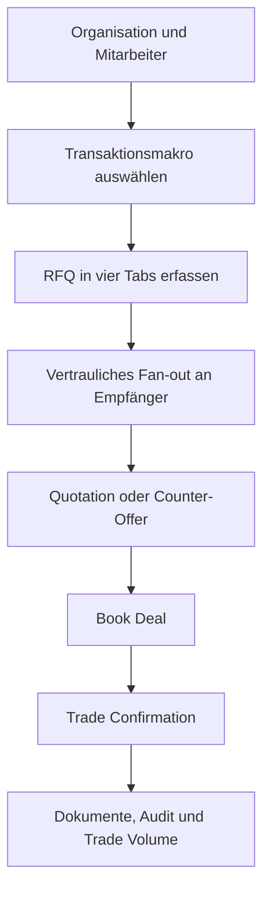
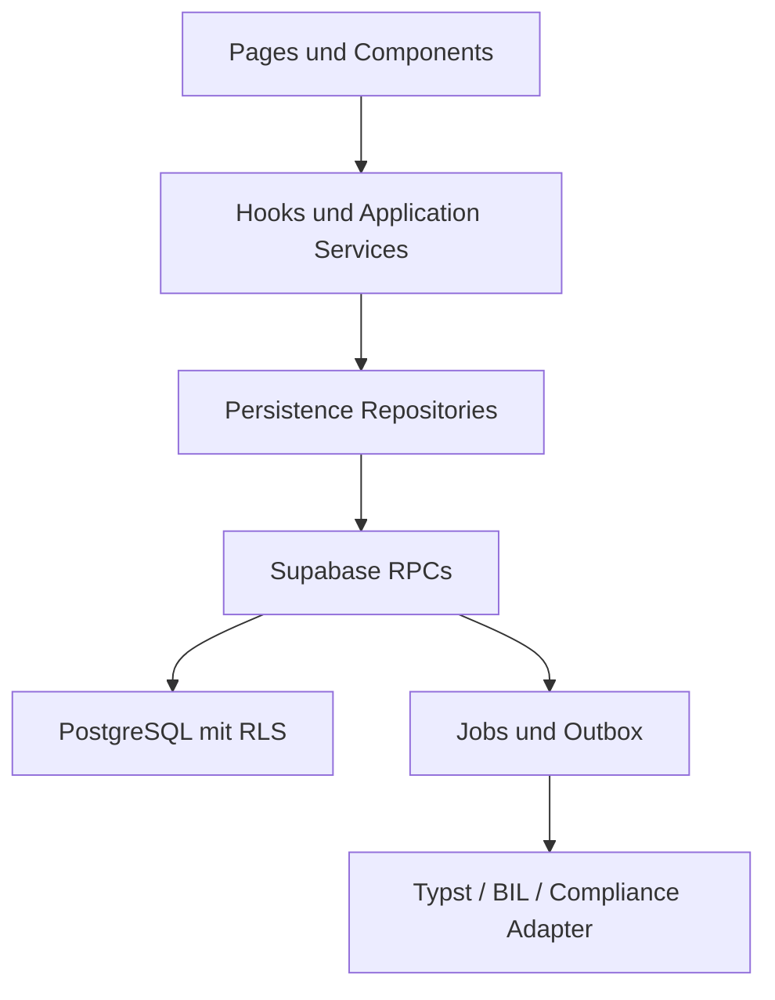
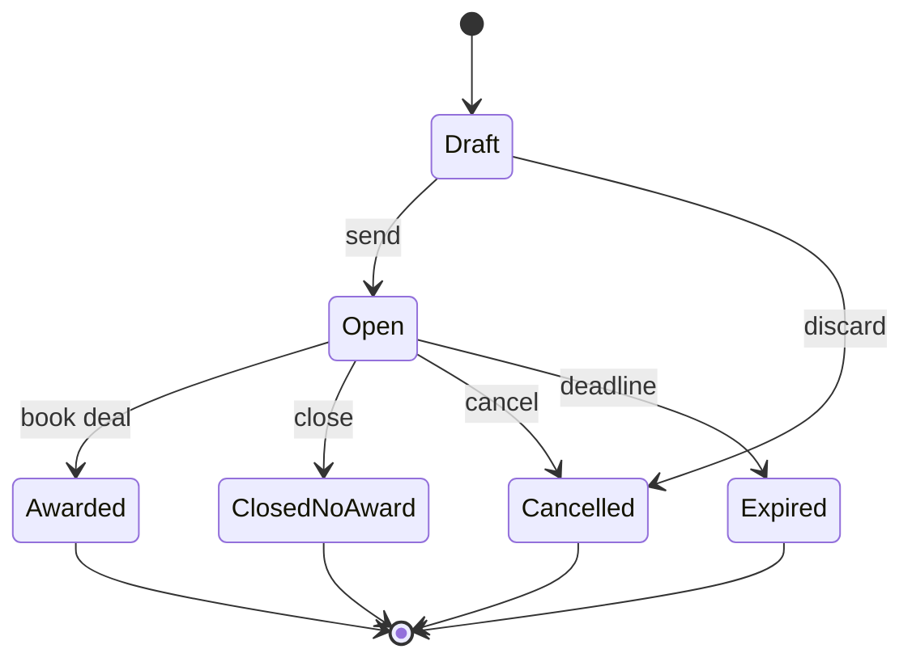
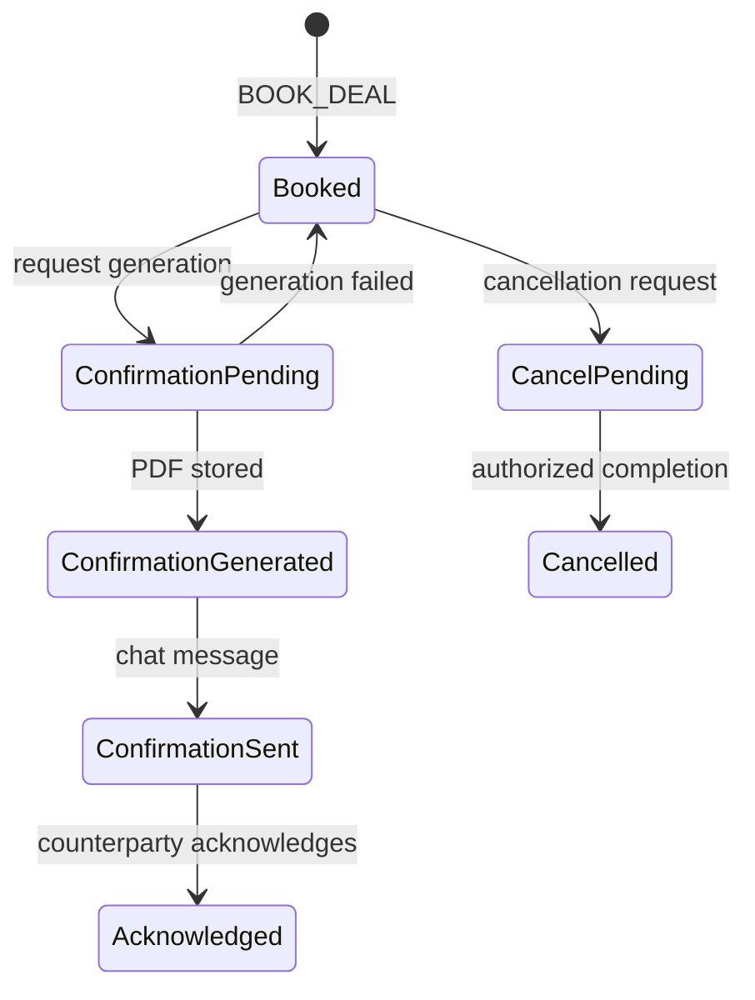

# xChat RFQ-, Quotation-, Deal- und Dokumentenplattform

## Abschließender, evolutionärer Micro-Step-Implementierungsbauplan

**Zielsystem:** xChat  
**Technologie:** React 18, TypeScript, Vite, shadcn/ui, Supabase Auth/PostgreSQL/Realtime/Storage  
**Ausführendes Modell:** DeepSeek V4 Pro  
**Dokumentstatus:** Abschließend und implementierungsbereit; die Buchungssemantik in Abschnitt 2.2 gilt als dokumentierte Standardannahme  
**Planstand:** 18. September 2026  
**Migrationsprinzip:** bestehende Migrationen niemals verändern; ausschließlich neue timestamped Migrationen  

---

## 1. Zweck dieses Dokuments

Dieser Bauplan beschreibt die vollständige, schrittweise Weiterentwicklung des bereits existierenden xChat von einem professionellen Chat mit generischem RFQ-Workflow zu einer organisationsbasierten Handels- und Operationsplattform für die Edelmetallindustrie.

Der Plan ist ausdrücklich **kein Greenfield-Redesign**. Er erhält die vorhandenen, bewährten Grundlagen:

- bilaterale Conversations zwischen Benutzern;
- Multi-Recipient-Dispatch als serverseitiges Fan-out;
- Supabase Auth, PostgreSQL, Realtime und RLS;
- `SECURITY DEFINER`-RPCs als einzige Schreib- und Lesegrenze für Trading-Daten;
- idempotente RFQ- und Deal-Aktionen;
- append-only Responses und Decisions;
- React-Hooks, Services und Persistence-Repositories;
- dreisprachige UI-Struktur in Englisch, Deutsch und Französisch;
- bestehende Quality Gates mit ESLint, Vite Build, jscpd, dependency-cruiser, Semgrep, pgTAP und Playwright.

Das Ergebnis soll folgende fachliche Kette vollständig abbilden:



---

## 2. Verbindliche Produktentscheidungen und Annahmen

### 2.1 Bestätigte Entscheidungen

1. Jeder Plattformbenutzer ist Mitarbeiter genau einer aktiven Organisation.
2. Benutzer handeln auf xChat nie privat, sondern immer als Vertreter ihrer Organisation.
3. Eine Organisation kann mehrere fachliche Fähigkeiten besitzen. Eine Raffinerie kann beispielsweise zugleich Feedstock einkaufen, Raffinationsservices anbieten und raffinierte Produkte verkaufen.
4. Organisationstypen beziehungsweise Fähigkeiten sind von Benutzerrechten zu trennen.
5. Mitarbeiter können bilateral oder per Fan-out an mehrere Mitarbeiter schreiben, auch organisationsübergreifend.
6. Eine RFQ darf mehrere Empfänger haben.
7. Der Sender sieht, an wen versandt wurde, ob zugestellt und angesehen wurde und ob eine Antwort eingegangen ist.
8. Ein Empfänger darf weder Identität noch Anzahl noch Status anderer RFQ-Empfänger erfahren.
9. KYC/KYS kommt später aus xComplianceFlow. In dieser Ausbaustufe werden ein sauberes Provider-/Repository-Design und Mock-Daten implementiert.
10. Inventory wird in xChat als serverseitige Projektion gehalten und später über die BIL API gespeist. In dieser Ausbaustufe wird ein Mock-Provider implementiert.
11. Trade Volume wird von xChat selbst aus gebuchten Deals geführt und kann zusätzlich kontrolliert per CSV importiert werden.
12. Live-Market-Data und Price-Ticker-Integration sind nicht Teil dieser Ausbaustufe.
13. Der Customer Document Storage existiert noch nicht und wird mit Supabase Storage neu aufgebaut.
14. RFQ Summary, Quotation und Trade Confirmation werden mit Typst erzeugt und direkt als strukturierte Chat-Nachrichten versendet.
15. `BOOK_DEAL` und Trade Confirmation sind im Scope.
16. Alte xTrace-Tabellen und -Referenzen gehören nicht zum Zielbild. Der Plan darf keine neue Funktion darauf aufbauen.
17. Das veraltete README und darin genannte, nicht vorhandene Migrationen sind keine Source of Truth.
18. npm und `package-lock.json` sind maßgeblich. `bun.lockb` wird als Altbestand behandelt, bis das Team ihn explizit entfernt.

### 2.2 Standardannahme zum Geschäftsabschluss

Dieser Bauplan verwendet folgende Semantik:

> Die Annahme einer gültigen Quotation mittels `BOOK_DEAL` schließt den Trade im System verbindlich ab. Die Trade Confirmation dokumentiert den bereits gebuchten Trade. Eine spätere Bestätigung des Dokuments ist ein Evidenz- und Kontrollschritt, aber keine zweite Voraussetzung für das Entstehen des Deals.

Soll diese Annahme rechtlich oder operativ geändert werden, ist ausschließlich die State Machine in Abschnitt 10 und die Freigabelogik in Phase 12 anzupassen. Das Datenmodell hält `confirmation_status` bewusst separat vom Dealstatus.

### 2.3 Bewusste Scope-Grenzen für Release 1

- Eine RFQ wird vollständig an genau einen Gewinner vergeben; Split Awards und Teilmengenvergaben sind nicht Bestandteil von Release 1.
- Keine automatische Preisberechnung aus Live-Market-Data.
- Keine produktive BIL- oder xComplianceFlow-Verbindung; nur Ports, Adapter, Mocks und Contract Tests.
- Kein Settlement-, Payment-, Shipment-Tracking oder ERP-Posting nach Trade Confirmation.
- Keine elektronische Signatur und kein QES-Workflow.
- Keine automatische rechtliche Bewertung der Verbindlichkeit eines Trades.
- Keine anonyme Auktion. Der RFQ-Sender kennt alle eingeladenen Empfänger; nur Empfänger sind gegeneinander abgeschirmt.
- Keine direkten Browserzugriffe auf externe BIL-, Compliance- oder Dokumenten-Worker-APIs.

---

## 3. Analyse des bestehenden Systems

### 3.1 Wiederzuverwendende Bestandteile

| Vorhandener Bestandteil | Verwendung im Zielbild |
|---|---|
| `conversations` | Bilateraler Kommunikationskanal zwischen zwei Mitarbeitern |
| `messages` | Chat-Timeline; wird um strukturierte Message Types und Objekt-Referenzen erweitert |
| `message_dispatch` | Idempotente Multi-Recipient-Sendeoperation |
| `message_dispatch_recipient` | Empfängerbezogenes Fan-out und Fehlerstatus |
| `quote_requests` | RFQ Aggregate Root; wird additiv erweitert |
| `quote_request_invitations` | Strikt isolierter Empfänger-Kontext pro RFQ |
| `quote_responses` | Append-only Quotation-/Counter-Kette; Payload wird generalisiert |
| `quote_response_decisions` | Append-only Accept/Reject-Ereignisse |
| `trade_deals` | Gebuchter Trade; wird um Organisations-Snapshots und Confirmation-Status ergänzt |
| `quote_workflow_idempotency` | Schutz gegen doppelte Submit-, Counter-, Reject- und Book-Aktionen |
| `send_messages` | Fan-out-Orchestrierung; wird nicht durch Client-Loops ersetzt |
| `effective_quote_status` | Grundlage für serverseitig berechneten Ablaufstatus |
| `raise_business_error` | Einheitliches Business-Error-Format |
| `toMessagingError` | Frontend-Mapping der Business Errors |
| Realtime User Topics | Empfängerbezogene Benachrichtigungen ohne Cross-Recipient-Leakage |
| Repository-Schicht | Einziger Frontend-Zugang zu Supabase/RPCs |

### 3.2 Zu ersetzende oder zu härtende Bestandteile

| Ist-Zustand | Zielzustand |
|---|---|
| `profile.organization` als Freitext | Normalisierte `organizations` und aktive `organization_memberships` |
| Rollen `vendor/manager/operator` | getrennte Organisation-Capabilities, Plattformrollen und Entitlements |
| Firmenverzeichnis in Seed/localStorage | serverautoritatives Organisationsverzeichnis |
| Generische RFQ-Felder | transaktionsspezifische Schemas mit vier Tabs |
| `premium` und `fees` im RFQ | Preispräferenzen im RFQ; verbindliche Pricing Components in der Quotation |
| `quoted_premium` als einzige Antwort | vollständige Quotation mit Preisen, Abzügen, Gebühren, Steuern und operativen Zusagen |
| TTL in Sekunden als primäre UX | verständliches Ablaufdatum mit Presets; Sekunden nur Transportdetail |
| nur `open/converted` | explizite RFQ-, Invitation-, Quote-, Deal- und Document-State-Machines |
| Mock-KYC direkt in UI | `ComplianceProvider` + Server-/Repository-Adapter + Mock-Implementation |
| Mock-Inventory direkt in UI | `InventoryProvider` + serverseitige Projektion + Mock-Implementation |
| kein Document Storage | private Supabase-Buckets, Metadaten, ACL, Versionen und Audit |
| keine Typst-Pipeline | reproduzierbarer Job-basierter Document Worker |
| direkte JSON-Strings ohne Version | versionierte JSON Schemas und serverseitige Canonicalization |

### 3.3 Vor Beginn zwingend zu bereinigender Baseline-Zustand

1. Die laufende Entfernung sämtlicher xTrace-spezifischer Datenbankobjekte muss abgeschlossen sein.
2. `supabase db reset` muss ausschließlich mit den tatsächlich vorhandenen Migrationen erfolgreich sein.
3. Der lokale xChat-Graph ist `graphify-out/graph.json`; der globale Graph mit anderen Repositories ist für diese Implementierung nicht zu verwenden.
4. Fehlende Konfigurationsdateien müssen an ihren erwarteten Pfaden vorhanden sein:
   - `.dependency-cruiser.cjs`
   - `.jscpd.json`
   - `.semgrep/architecture.yml`
   - `.env.example`
   - `package-lock.json`
   - `scripts/run-semgrep.sh`
5. Keine produktiven Secrets dürfen in `VITE_*`-Variablen liegen. BIL- und Compliance-Credentials gehören später ausschließlich in serverseitige Secrets.

---

## 4. Begriffe und fachliche Trennung

| Begriff | Bedeutung |
|---|---|
| Organisation | Juristische oder operative Firma, die auf xChat teilnimmt |
| Capability | Fachliche Marktrolle einer Organisation, z. B. `REFINER` oder `MINE_OPERATOR` |
| Platform Role | Interne xChat-Berechtigungsrolle eines Mitarbeiters, z. B. `TRADER` oder `ORG_ADMIN` |
| Entitlement | Feingranulare Erlaubnis, z. B. `RFQ_CREATE` oder `DEAL_BOOK` |
| Department/Desk | Organisationseinheit für Zuständigkeit und Routing |
| RFQ | Strukturierte Anfrage mit Bedingungen und Antwortfrist |
| Invitation | Empfängerisolierte Zustellung einer RFQ |
| Quotation | Preis- und Leistungsangebot als Antwort auf eine Invitation |
| Counter-Offer | Neue, append-only Version eines Angebots auf Basis einer vorherigen Response |
| Deal | Nach `BOOK_DEAL` gebuchtes Geschäft mit unveränderlichem Terms Snapshot |
| Trade Confirmation | Aus dem Deal-Snapshot erzeugtes Belegdokument |
| Inventory Projection | In xChat gehaltene, synchronisierte Sicht; nicht automatisch Eigentumsnachweis |
| Compliance Snapshot | Zeitpunktbezogene KYC/KYS-Aussage; keine vollständige Compliance-Akte |

---

## 5. Transaktionsmakros und Zulässigkeit

### 5.1 Zielmakros

| Code | Requester | Typischer Empfänger | Angefragte Leistung |
|---|---|---|---|
| `REFINE_AND_RETURN` | Mine, CPP, Trader, Owner of Metal | Refiner | Verarbeitung; wirtschaftliches Metall bleibt beim Requester |
| `SELL_DORE` | Mine, CPP, Trader | Refiner oder Trader | Kaufangebot für Doré beziehungsweise enthaltene Metalle |
| `REFINE_AND_SELL` | Mine, CPP, Trader | Refiner | Raffination plus anschließender Verkauf des Fine Metals |
| `BUY_REFINED_METAL` | Bank, Dealer, Fabricator, Investor, Trader | Refiner oder Dealer | Kauf raffinierter Barren, Grain oder anderer Produkte |
| `SELL_REFINED_METAL` | Refiner, Dealer, Bank, Vault, Investor, Trader | Refiner, Dealer oder Bank | Ankauf bestehender raffinierter Produkte |
| `FABRICATE_METAL` | Kunde mit Metal Account | Refiner oder Mint | Umwandlung einer Metal-Account-Balance in Produkte |
| `BUY_FEEDSTOCK` | Refiner oder Trader | Mine, CPP oder Trader | Buyer lädt zur Abgabe eines Angebots für Feedstock ein |

### 5.2 Keine harte Kopplung zwischen Organisationstyp und UI

Makros werden nicht allein anhand eines einzelnen Organisationstyps ein- oder ausgeblendet. Die serverseitige Zulässigkeit ergibt sich aus:

1. aktiver Organisationsmitgliedschaft des Benutzers;
2. aktiver Capability der Organisation;
3. persönlichem Entitlement des Benutzers;
4. aktivem Status des Benutzers und der Organisation;
5. zulässiger Capability des Empfängers;
6. Counterparty-/Compliance-Status;
7. optionalem Product- und Desk-Scope des Benutzers.

Der Client darf unzulässige Makros aus UX-Gründen verbergen, aber **nur der Server entscheidet verbindlich**.

### 5.3 Capability-Codes

`MINE_OPERATOR`, `CPP`, `REFINER`, `TRADER`, `DEALER`, `BANK`, `VAULT`, `FABRICATOR`, `MINT`, `LOGISTICS_PROVIDER`, `INVESTOR`, `AUDITOR`, `OTHER`.

### 5.4 Benutzerrollen und Entitlements

Empfohlene Rollen: `PLATFORM_ADMIN`, `ORG_ADMIN`, `TRADER`, `SALES`, `OPERATIONS`, `COMPLIANCE`, `VIEWER`.

Minimale Entitlements:

- `DIRECTORY_READ`
- `CHAT_SEND`
- `RFQ_CREATE`
- `RFQ_RESPOND`
- `RFQ_COUNTER`
- `RFQ_CANCEL`
- `DEAL_BOOK`
- `DEAL_VIEW`
- `TRADE_CONFIRMATION_GENERATE`
- `TRADE_CONFIRMATION_ACKNOWLEDGE`
- `DOCUMENT_VIEW`
- `DOCUMENT_DOWNLOAD`
- `INVENTORY_VIEW`
- `INVENTORY_SYNC`
- `TRADE_VOLUME_VIEW`
- `TRADE_VOLUME_IMPORT`
- `ORG_MEMBERS_MANAGE`
- `ORG_CAPABILITIES_MANAGE`

---

## 6. Formulararchitektur

### 6.1 Gemeinsame UX-Struktur

Jedes Transaktionsmakro öffnet denselben Composer-Rahmen mit vier direkt erreichbaren Tabs:

1. **Commercial**
2. **Material**
3. **Assay**
4. **Logistics**

Oben bleiben Transaktionstyp, Empfänger, Status und Ablaufzeit sichtbar. Unten bleiben `Save Draft`, `Preview`, `Send RFQ` beziehungsweise `Send Quotation` sichtbar. Ein Tab zeigt Fehleranzahl und Vollständigkeitsstatus.

### 6.2 Request versus Response

Die RFQ beschreibt den Bedarf und gewünschte Randbedingungen. Die Quotation beschreibt das konkrete Angebot.

| Thema | RFQ | Quotation |
|---|---|---|
| Preis | gewünschte Preisbasis oder Vorgabe | angebotener Preis beziehungsweise Formel |
| Premium/Discount | optional gewünschte Darstellungsart oder Obergrenze | konkrete Pricing Component |
| Fees | keine vom Requester erfundenen Anbietergebühren; nur gewünschte Inklusivität oder Caps | konkrete, einzeln ausgewiesene Gebühren |
| VAT/Tax | gewünschte Behandlung oder Steuerkontext | konkrete Steuerbehandlung und Betrag/Satz, soweit bekannt |
| Validity | gewünschte Antwortfrist | Angebotsgültigkeit, höchstens bis RFQ-Ablauf oder explizit servervalidiert |
| Material | Spezifikation beziehungsweise angebotener Feedstock | angenommene Spezifikation, Toleranzen und Abweichungen |
| Assay | vorhandene Daten und gewünschtes Settlement-Verfahren | akzeptiertes Verfahren, Payability, Deductions, Umpire Terms |
| Logistics | gewünschter Ort, Zeitraum und Incoterm | verbindliche Route, Lead Time und Zuständigkeiten |

### 6.3 Gemeinsame RFQ-Felder

#### Commercial

| Feld | Typ | Pflicht | Regel |
|---|---:|---:|---|
| `transactionType` | enum | ja | eines der sieben Makros |
| `reference` | string(1..80) | nein | menschliche Referenz, serverseitig getrimmt |
| `responseDeadline` | timestamptz | ja | Zukunft; UX zeigt Datum/Uhrzeit und Presets |
| `settlementCurrency` | ISO-4217 string(3) | bedingt | erforderlich, wenn Geldpreisbestandteile erwartet werden |
| `priceBasisPreference` | enum | nein | `OUTRIGHT`, `BENCHMARK_PLUS_DIFFERENTIAL`, `FIXING`, `FORMULA`, `OPEN_TO_QUOTE` |
| `benchmarkPreference` | string(0..100) | nein | nur Referenztext; keine Market-Data-Anbindung |
| `paymentTermsPreference` | string(0..500) | nein | z. B. T+2 oder nach final assay |
| `taxContext` | enum/string | nein | `EXCLUSIVE`, `INCLUSIVE`, `EXEMPT`, `REVERSE_CHARGE`, `TO_BE_DETERMINED` |
| `partialFulfilmentAllowed` | boolean | ja | in Release 1 zwingend `false` |
| `notes` | string(0..4000) | nein | keine Secrets oder KYC-Dokumente |

#### Material

| Feld | Typ | Pflicht | Regel |
|---|---:|---:|---|
| `primaryMetal` | enum | ja | `AU`, `AG`, `PT`, `PD`, `OTHER` |
| `materialForm` | enum | ja | z. B. `DORE`, `CONCENTRATE`, `ORE`, `SCRAP`, `BAR`, `GRAIN`, `ACCOUNT_BALANCE` |
| `productName` | string(1..200) | ja | menschenlesbar |
| `productCode` | string(0..100) | nein | interne/externe Referenz |
| `quantity` | decimal(28,8) | ja | > 0 |
| `quantityUnit` | enum | ja | `KG`, `G`, `TOZ`, `MT`, `PCS` |
| `quantityTolerancePct` | decimal(7,4) | nein | 0..100 |
| `declaredFineness` | decimal(12,8) | bedingt | 0..1 oder klar versionierte Einheit |
| `lotCount` | integer | nein | > 0 |
| `packaging` | string(0..500) | nein | |
| `inventoryReferences` | UUID[] | nein | nur auswählbare, berechtigte Projektionen |

#### Assay

| Feld | Typ | Pflicht | Regel |
|---|---:|---:|---|
| `assayStatus` | enum | ja | `NOT_AVAILABLE`, `PROVISIONAL`, `FINAL` |
| `assayMethod` | enum/string | bedingt | z. B. `FIRE_ASSAY`, `XRF`, `ICP`, `OTHER` |
| `assayDate` | date | nein | nicht in Zukunft |
| `laboratoryName` | string(0..200) | nein | |
| `declaredComposition` | array | nein | Elementcode + Anteil + Einheit |
| `settlementAssayPreference` | enum | bedingt | `SELLER`, `BUYER`, `REFINER`, `INDEPENDENT`, `UMPIRE` |
| `samplingMethod` | string(0..500) | nein | |
| `umpireTerms` | string(0..1000) | nein | |
| `assayDocumentIds` | UUID[] | nein | nur Dokumente mit Zugriffsrecht |

#### Logistics

| Feld | Typ | Pflicht | Regel |
|---|---:|---:|---|
| `currentLocation` | Location object | ja | Land, Ort; genaue Adresse optional und geschützt |
| `deliveryLocation` | Location object | bedingt | je Transaktion |
| `availabilityFrom` | date/timestamptz | ja | |
| `deliveryWindowEnd` | date/timestamptz | nein | >= availabilityFrom |
| `incoterm` | enum/string | nein | ICC-Code plus benannter Ort |
| `transportResponsibility` | enum | nein | `REQUESTER`, `RESPONDER`, `THIRD_PARTY`, `TO_BE_AGREED` |
| `insuranceResponsibility` | enum | nein | analog |
| `securityRequirements` | string(0..1000) | nein | |
| `exportImportConstraints` | string(0..1000) | nein | |
| `logisticsDocumentIds` | UUID[] | nein | nur berechtigte Dokumente |

### 6.4 Quotation Pricing Components

Premium und Fees sind keine zwei konkurrierenden Freitextfelder. Jede Quotation besitzt null bis viele typisierte Preisbestandteile:

| `componentType` | Beispiele |
|---|---|
| `METAL_PRICE` | Outright-Preis oder Benchmark-Referenz |
| `PREMIUM` | Aufschlag auf Spot/Fixing |
| `DISCOUNT` | Abschlag |
| `REFINING_CHARGE` | Raffinationsgebühr |
| `TREATMENT_CHARGE` | Treatment Charge für Feedstock |
| `ASSAY_FEE` | Analysegebühr |
| `FABRICATION_FEE` | Fertigungsgebühr |
| `LOGISTICS_FEE` | Transportkosten |
| `INSURANCE_FEE` | Versicherungskosten |
| `MINIMUM_CHARGE` | Mindestgebühr |
| `TAX` | VAT oder andere Steuer |
| `BYPRODUCT_CREDIT` | Gutschrift für Nebenmetalle |
| `OTHER` | begründungspflichtig |

Jede Komponente enthält:

- `componentType`;
- `label`;
- `calculationMethod`: `FIXED_AMOUNT`, `PER_UNIT`, `PERCENTAGE`, `BASIS_POINTS`, `FORMULA`, `INCLUDED`;
- `rateOrAmount` als Decimal oder Formeltext;
- `currency` beziehungsweise `unit`;
- `chargeDirection`: `PAYABLE_BY_REQUESTER`, `PAYABLE_BY_RESPONDER`, `CREDIT_TO_REQUESTER`, `CREDIT_TO_RESPONDER`;
- `taxTreatment`;
- `minimumAmount` und `maximumAmount`, falls relevant;
- `notes`.

### 6.5 Makrospezifische Ergänzungen

#### `REFINE_AND_RETURN`

- Material: Feedstock-Art, Dry/Wet Weight, Moisture, erwartete Feinmetalle, Deleterious Elements, Batch-/Lot-Information.
- Assay: Provisional Assay, Sampling/Splitting, Final Assay Authority, Umpire-Regeln.
- Commercial RFQ: gewünschte Turnaround Time, Metal-Account-Ziel, Return Form, Mindest-Recovery-Anforderung.
- Quotation: Refining Charge, Assay Fee, Minimum Charge, Metal Loss/Retention, Payability, Recovery, Byproduct Credits, Turnaround Commitment.
- Logistics: Anlieferung zur Raffinerie und Rücklieferung/Metal Account.

#### `SELL_DORE`

- Material: Doré-Gewicht, erwartete Au-/Ag-/PGM-Gehalte, Herkunfts- und Lot-Referenzen.
- Assay: vorhandener Assay und Settlement-Assay-Verfahren.
- Commercial RFQ: gewünschte Preisbasis und Settlement-Zeitpunkt; keine vorgegebenen Anbietergebühren.
- Quotation: Payability je Metall, Benchmark/Formel, Treatment/Refining Charges, Deductions, Penalties, Settlement Timing.
- Logistics: aktueller Standort, Abholung/Anlieferung, Risk Transfer.

#### `REFINE_AND_SELL`

- Kombination von `REFINE_AND_RETURN` und `SELL_DORE`.
- Zusätzlich: Wahl, ob Verkauf auf provisional oder final assay erfolgt; Preisfixierungsfenster; Refining Fees separat oder im Purchase Price verrechnet.

#### `BUY_REFINED_METAL`

- Material: Form, Brand, Refinery, Akkreditierung, Fineness, Bar Size, Stückzahl, Serien-/Bar-List-Verfügbarkeit.
- Commercial RFQ: gewünschte Preisbasis, Currency, Menge und Settlement.
- Quotation: Outright oder Premium, verfügbare Menge, Brand, genaue Produktspezifikation, Angebotsgültigkeit.
- Assay: Certificate/Assay Reference; normalerweise keine Umpire-Kette.
- Logistics: Vault/Location, Allocated/Unallocated, Delivery versus Book Transfer.

#### `SELL_REFINED_METAL`

- Material: existierendes Produkt, Eigentums-/Custody-Kontext, Bar List, Zustand, Provenance-/Integrity-Referenzen.
- Quotation: Bid Price oder Discount, Acceptance Criteria, Inspection Requirement, Settlement.
- Logistics: Übergabeort, Vault Transfer oder physische Lieferung.

#### `FABRICATE_METAL`

- Material: Metal Account, verfügbare Balance, Zielprodukte, Stückzahlen, Größen, Fineness, Brand, Packaging.
- Commercial RFQ: gewünschter Fertigungstermin und Serviceumfang.
- Quotation: Fabrication Fee je Einheit, Setup Fee, Minimum Charge, Metal Loss/Tolerance, Lead Time.
- Assay: Herkunfts-/Feinheitsnachweis der Account-Balance; kein unnötiger Assay-Zwang.
- Logistics: Delivery oder Vault Credit, Packaging und Versand.

#### `BUY_FEEDSTOCK`

- Der Requester beschreibt gesuchtes Material, Mengenband, akzeptierte Herkunft, Assay-Band, Delivery Window und Purchase Terms.
- Der Empfänger antwortet mit seinem konkreten verfügbaren Material, Mengen, Assay, Standort und Price Formula.
- Die UI darf dies als `Request for Offer` erläutern; technisch bleibt es derselbe sichere RFQ-Aggregattyp.

---

## 7. Zielarchitektur

### 7.1 Schichten



Regeln:

- Components importieren keine Persistence-, Realtime- oder Supabase-Infrastruktur.
- Hooks orchestrieren UI-Zustand, enthalten aber keine SQL- oder HTTP-Details.
- Repositories mappen DTOs und RPCs.
- Domain-Validation ist zwischen TypeScript/Zod und SQL-Validation semantisch identisch.
- Externe Provider werden hinter Interfaces gekapselt.
- Alle schreibenden Operationen sind idempotent.
- Serverzeit ist für Deadlines und Status maßgeblich.

### 7.2 Neue Modulstruktur

```text
src/
  domain/
    organizations/
    rfq/
    quotations/
    deals/
    documents/
    inventory/
    compliance/
    trade-volume/
  services/
    application/
    integrations/
      bil/
      compliance/
      documents/
  services/persistence/
    organizationRepository.ts
    rfqRepository.ts
    quotationRepository.ts
    dealRepository.ts
    documentRepository.ts
    inventoryRepository.ts
    complianceRepository.ts
    tradeVolumeRepository.ts
  components/chat/trading/
  hooks/trading/
  schemas/
    rfq/
    quotation/
docs/api/
  openapi.yaml
  schemas/
supabase/
  migrations/
  functions/
  tests/
document-worker/
  templates/
  src/
  tests/
```

Diese Struktur darf evolutionär eingeführt werden. Bestehende Dateien werden nicht in einer Big-Bang-Änderung verschoben.

---

## 8. Datenmodell

### 8.1 Organisationen und Mitarbeiter

#### `organizations`

| Spalte | Typ | Regeln |
|---|---|---|
| `id` | uuid | PK, `gen_random_uuid()` |
| `legal_name` | text | not null, 1..300 |
| `display_name` | text | not null, 1..160 |
| `registration_number` | text | nullable |
| `lei` | text | nullable, normalisiert |
| `jurisdiction_country_code` | char(2) | ISO 3166-1 alpha-2 |
| `status` | text | `pending`, `active`, `suspended`, `inactive` |
| `source_system` | text | `xchat`, `bil`, `import` |
| `external_reference` | text | nullable |
| `created_at`, `updated_at` | timestamptz | not null |

Constraints/Indexes:

- unique partial index auf `(source_system, external_reference)` wenn External Reference vorhanden;
- Index auf `lower(display_name)`;
- Index auf `status` nur wenn Directory-Abfragen ihn nutzen;
- `updated_at`-Trigger;
- keine physische Löschung bei historischen RFQs oder Deals.

#### `organization_capabilities`

`organization_id uuid`, `capability_code text`, `status text`, `valid_from timestamptz`, `valid_until timestamptz`, `created_at`; PK `(organization_id, capability_code, valid_from)`; nur eine aktuell aktive Capability je Code und Organisation über Partial Unique Index.

#### `organization_units`

`id uuid`, `organization_id uuid`, `parent_unit_id uuid nullable`, `unit_type text` (`department`, `desk`, `site`), `name text`, `status text`, `created_at`, `updated_at`. Index auf `(organization_id, status)` und Schutz gegen Cross-Organization-Parents per Constraint Trigger.

#### `organization_memberships`

`id uuid`, `user_id uuid`, `organization_id uuid`, `primary_unit_id uuid nullable`, `status text`, `job_title text`, `valid_from`, `valid_until`, `created_at`, `updated_at`.

- Partial Unique Index auf `user_id WHERE status = 'active'` garantiert genau höchstens eine aktive Organisation.
- Aktivierung eines Users verlangt eine aktive Organisation.
- Historische Memberships werden nicht überschrieben.
- Trade-/RFQ-Tabellen speichern zusätzlich Organisations-Snapshots, damit spätere Arbeitgeberwechsel Historie nicht umdeuten.

#### Rollen und Entitlements

- `platform_roles(code, description)`
- `platform_entitlements(code, description)`
- `platform_role_entitlements(role_code, entitlement_code)`
- `user_platform_roles(user_id, role_code, organization_id, valid_from, valid_until)`
- optional später `user_entitlement_overrides` mit Four-Eyes-Governance.

### 8.2 RFQ Aggregate

#### Erweiterung `quote_requests`

| Neue/geänderte Spalte | Typ | Regeln |
|---|---|---|
| `requester_organization_id` | uuid | not null nach Backfill |
| `transaction_type` | text | sieben freigegebene Codes |
| `schema_version` | integer | >= 1 |
| `public_reference` | text | eindeutige, nicht erratbare Anzeige-ID |
| `terms` | jsonb | kanonisches Objekt mit `commercial`, `material`, `assay`, `logistics` |
| `status` | text | erweiterte State Machine |
| `response_deadline` | timestamptz | not null für versandte RFQs |
| `closed_at` | timestamptz | nullable |
| `close_reason` | text | nullable |
| `created_at`, `updated_at` | timestamptz | not null |

Indexes:

- `(owner_user_id, created_at desc)` beibehalten;
- `(requester_organization_id, created_at desc)`;
- `(status, response_deadline)` für Expiry Job;
- `(transaction_type, created_at desc)`;
- GIN auf `terms` nur, wenn eine konkrete Suchabfrage existiert; kein vorsorglicher Vollindex.

#### Erweiterung `quote_request_invitations`

| Spalte | Typ | Regeln |
|---|---|---|
| `recipient_organization_id` | uuid | not null nach Backfill |
| `status` | text | `sent`, `delivered`, `viewed`, `responded`, `declined`, `closed`, `expired` |
| `delivered_at` | timestamptz | serverseitig |
| `first_viewed_at` | timestamptz | write-once |
| `last_viewed_at` | timestamptz | monoton aktualisiert |
| `responded_at` | timestamptz | serverseitig |
| `closed_at` | timestamptz | nullable |
| `close_reason` | text | interner Code; Empfängerprojektion darf Winner-Details nicht zeigen |

Constraints:

- `(request_id, recipient_user_id)` bleibt unique;
- Empfänger muss beim Versand aktive Membership in `recipient_organization_id` besitzen;
- Requester und Recipient dürfen nicht derselbe User sein;
- Cross-Recipient-Ausgaben sind serverseitig verboten.

#### `quote_request_events`

Append-only Audit-Tabelle: `id bigserial`, `request_id`, `invitation_id nullable`, `actor_user_id`, `actor_organization_id`, `event_type`, `event_payload jsonb`, `correlation_id uuid`, `created_at`. Kein Update/Delete für authenticated.

### 8.3 Quotation Aggregate

#### Erweiterung `quote_responses`

- `responder_organization_id uuid not null`;
- `schema_version integer not null`;
- `response_terms jsonb not null` mit denselben vier Tabs und Quotation-spezifischen Feldern;
- `valid_until timestamptz not null`;
- `status` erweitert um `submitted`, `countered`, `superseded`, `withdrawn`;
- `quoted_premium` bleibt während Migration lesbar, wird danach deprecated und nicht mehr geschrieben;
- `parent_response_id` bildet die unveränderliche Negotiation Chain;
- jede neue Response superseded logisch die vorherige, ohne sie zu verändern.

#### `quote_pricing_components`

| Spalte | Typ |
|---|---|
| `id` | uuid PK |
| `response_id` | uuid FK |
| `sequence_no` | integer > 0 |
| `component_type` | text |
| `label` | text |
| `calculation_method` | text |
| `numeric_value` | numeric(28,10) nullable |
| `formula_text` | text nullable |
| `currency_code` | char(3) nullable |
| `unit_code` | text nullable |
| `charge_direction` | text |
| `tax_treatment` | text nullable |
| `minimum_amount` | numeric(28,10) nullable |
| `maximum_amount` | numeric(28,10) nullable |
| `notes` | text nullable |

Constraints:

- unique `(response_id, sequence_no)`;
- genau eine der zulässigen Value-Formen passend zu `calculation_method`;
- Minimum <= Maximum;
- `OTHER` verlangt nichtleeres Label und Notes;
- Components einer Response sind nach Submit unveränderlich.

### 8.4 Deals und Confirmations

#### Erweiterung `trade_deals`

- `requester_organization_id uuid not null`;
- `counterparty_organization_id uuid not null`;
- `transaction_type text not null`;
- `deal_reference text unique not null`;
- `status text`: zunächst `booked`, später `cancel_pending`, `cancelled`;
- `confirmation_status text`: `not_generated`, `generation_pending`, `generated`, `sent`, `acknowledged`, `failed`;
- `commercial_terms_snapshot jsonb not null` enthält Request, ausgewählte Response, Pricing Components, Parteien, Zeitpunkte und Schema-Versionen;
- `booked_at timestamptz not null` getrennt von `created_at`;
- `version integer not null default 1` für spätere Amendments, ohne Release-1-Amendment-UI.

Die bestehende Unique Constraint auf `request_id` bleibt für Release 1 und erzwingt Single Award.

#### `deal_events`

Append-only: `deal_booked`, `confirmation_requested`, `confirmation_generated`, `confirmation_sent`, `confirmation_viewed`, `confirmation_acknowledged`, `cancellation_requested`, `cancelled`.

### 8.5 Integration, Inventory und Compliance

#### `integration_connections`

Konfiguration ohne Secrets: `id`, `organization_id nullable`, `provider_type`, `provider_name`, `status`, `base_url_reference`, `config jsonb`, `created_at`, `updated_at`. Credentials nur als serverseitige Secret Reference.

#### `inventory_lots`

`id`, `organization_id`, `source_system`, `external_reference`, `primary_metal`, `material_form`, `quantity`, `quantity_unit`, `fineness`, `location jsonb`, `availability_status`, `source_observed_at`, `synced_at`, `raw_source_hash`, `metadata jsonb`.

- unique `(source_system, organization_id, external_reference)`;
- keine Behauptung von Eigentum allein aus BIL-Daten;
- `available`, `reserved`, `unavailable`, `unknown` als operative xChat-Sicht;
- RFQs speichern nur Referenzen und Snapshots, nicht mutable Live-Daten.

#### `inventory_sync_runs`

Status, Cursor, Counts, Errors, Provider, Started/Finished, Correlation ID. Mock und BIL nutzen denselben Contract.

#### `compliance_snapshots`

`id`, `subject_organization_id`, `viewer_organization_id`, `provider`, `external_reference`, `kyc_status`, `kys_status`, `trading_eligibility`, `reason_codes jsonb`, `checked_at`, `expires_at`, `source_hash`, `created_at`.

- keine vollständigen KYC-Akten kopieren;
- nur minimal erforderliche Statusdaten;
- Zugriff nur für berechtigte Angehörige der Viewer Organization;
- RFQ/Deal Snapshot speichert die für die Entscheidung verwendete Snapshot-ID.

### 8.6 Trade Volume und CSV-Import

#### `trade_volume_entries`

Append-only: `id`, `organization_id`, `counterparty_organization_id`, `deal_id nullable`, `source_type` (`xchat_deal`, `csv_import`, `adjustment`), `source_reference`, `primary_metal`, `quantity`, `quantity_unit`, `normalized_grams`, `trade_date`, `created_by_user_id`, `created_at`.

- Unique auf Deal-Eintrag pro Organisation/Deal;
- CSV-Einträge idempotent über Batch + Row Hash;
- Korrekturen als Gegenbuchung, nicht als Update.

#### CSV-Tabellen

- `trade_volume_import_batches`
- `trade_volume_import_rows`
- Batchstatus: `uploaded`, `validating`, `validation_failed`, `ready`, `committing`, `completed`, `failed`;
- Rowstatus: `valid`, `invalid`, `duplicate`, `committed`;
- rohe Datei privat im Import-Bucket;
- keine Commit-Möglichkeit bei einer ungültigen Zeile, außer ein später explizit freigegebener Partial-Import-Modus.

### 8.7 Dokumente und Storage

#### Tabellen

- `documents`: logische Dokumentidentität und Typ;
- `document_versions`: unveränderliche Datei-Versionen mit Storage-Pfad, SHA-256, MIME, Size und Template-Version;
- `document_tags`: normalisierte Tags;
- `document_access_grants`: Organisation/User, Rechte und Gültigkeit;
- `document_generation_jobs`: Jobstatus, Idempotency Key, Payload Hash, Retry Count, Fehlercode;
- `document_events`: append-only View/Download/Send/Acknowledge Audit.

#### Private Buckets

- `trade-documents`
- `trade-document-sources`
- `trade-volume-imports`

Beispielpfad:

```text
deal/{deal_id}/document/{document_id}/version/{version_no}/trade-confirmation.pdf
```

Der Pfad ist keine Autorisierung. Zugriff wird ausschließlich über Metadaten, RPC und Storage-RLS beziehungsweise kurzlebige Signed URLs geprüft.

### 8.8 Kern-Constraints

1. IDs sind UUIDs; Eventtabellen dürfen Bigserial für Sortierung ergänzen.
2. Geld- und Mengenwerte sind `numeric`, niemals Float.
3. Einheiten und Währungen werden explizit gespeichert.
4. Zeitpunkte sind `timestamptz` in UTC; UI lokalisiert.
5. Submit- und Book-Payloads werden kanonisiert und gehasht.
6. Keine mutable Terms nach Submit; Änderungen erzeugen neue Version/Response.
7. Historische Benutzer- und Organisationszugehörigkeit wird gesnapshottet.
8. Kein Hard Delete von RFQs, Responses, Deals, Documents oder Audit Events.
9. `auth.uid()` wird in jeder RPC zuerst geprüft.
10. Alle IDs aus Request-Payloads werden serverseitig gegen Sichtbarkeit und Zugehörigkeit validiert.

---

## 9. RLS- und Sicherheitsmodell

### 9.1 Grundsatz

RLS ist Defense in Depth. Trading-Tabellen erhalten keine direkten Client-Schreibrechte. Sämtliche Writes und sensible Reads laufen über eng begrenzte `SECURITY DEFINER`-RPCs mit `SET search_path = ''`, vollständig qualifizierten Objektnamen und minimalen Grants.

### 9.2 Rollenbezogene Sicht

| Objekt | Requester | Eingeladener Empfänger | Andere Empfänger | Dritte |
|---|---:|---:|---:|---:|
| RFQ Terms | vollständig | vollständig, soweit geteilt | nie über Geschwister-Invitation | nein |
| Empfängerliste | ja | nein | nein | nein |
| Delivery/View Status | ja, je Empfänger | eigener Status | nein | nein |
| Responses | alle eigenen Invitations | nur eigene Invitation Chain | nein | nein |
| Gewinneridentität | ja | nur wenn selbst Gewinner | nein | nein |
| Deal | Dealparteien | Dealparteien | nein | nein |
| Dokument | Grants | Grants | nein | nein |
| Compliance | erlaubter Snapshot | nur eigene Counterparty-Sicht | nein | nein |

### 9.3 No-Tolerance Cross-Recipient Guardrails

1. Kein Endpoint für Empfänger darf `request_id -> invitations[]` zurückgeben.
2. Empfänger lesen eine Invitation nur über ihre `invitation_id` und `recipient_user_id = auth.uid()`.
3. Response Queries beginnen bei der autorisierten Invitation, nicht beim Request.
4. Realtime Topics bleiben `user:{auth.uid}`; keine RFQ-weiten Recipient Topics.
5. Errors dürfen keine Existenz anderer Invitations verraten.
6. Counts, Winner, Response Count und Empfängerstatus erscheinen nur im Requester Projection DTO.
7. Ein Empfänger erhält beim Abschluss lediglich `RFQ_CLOSED`; keine Information über anderen Empfänger oder Preis.
8. Signed Document URLs werden erst nach Grant-Prüfung erstellt und sind kurzlebig.
9. Storage Bucket Listing ist für Clients verboten.
10. Negative pgTAP- und E2E-Tests verwenden mindestens drei Organisationen und versuchen systematisch IDOR-Zugriffe.

### 9.4 SECURITY DEFINER-Checkliste je RPC

- `auth.uid()` vorhanden;
- aktive Membership laden und sperren, wenn für Mutation erforderlich;
- Entitlement prüfen;
- Request/Invitation/Response `FOR UPDATE` sperren bei Statuswechsel;
- Organisationen aus Membership ableiten, nie aus Client-Payload vertrauen;
- alle Payload-Keys allowlisten;
- Datentyp, Länge, Range, Enum und Cross-Field-Regeln validieren;
- Idempotency Key + canonical payload vergleichen;
- Statusübergang prüfen;
- Mutation + Event + Message + Outbox in einer Transaktion;
- neutralen Business Error werfen;
- `GRANT EXECUTE ... TO authenticated`;
- `REVOKE EXECUTE ... FROM PUBLIC, anon`;
- direkte Tabellenrechte widerrufen;
- Tests für Owner, Recipient, Sibling Recipient, Same Org Non-Recipient, Third Party und unauthenticated.

---

## 10. State Machines

### 10.1 RFQ



`PARTIALLY_RESPONDED` wird als berechnete UI-Projektion behandelt, nicht zwingend als persistierter RFQ-Status.

### 10.2 Invitation

`SENT -> DELIVERED -> VIEWED -> RESPONDED`; von offenen Zuständen nach `DECLINED`, `EXPIRED` oder `CLOSED`. Timestamps sind monoton und dürfen nicht zurückgesetzt werden.

### 10.3 Quotation

`SUBMITTED -> SUPERSEDED`, `ACCEPTED`, `REJECTED`, `WITHDRAWN`, `EXPIRED`. Ein Counter erzeugt eine neue Response und superseded die vorherige logisch.

### 10.4 Deal und Confirmation



Der Deal bleibt auch dann `booked`, wenn die Dokumenterzeugung fehlschlägt. Der Fehler ist sichtbar und retrybar; er darf den bereits gebuchten Trade nicht zurückrollen.

---

## 11. API- und RPC-Design

### 11.1 Canonical API Contract

`docs/api/openapi.yaml` ist der technologieunabhängige Contract. Die React-Anwendung verwendet zunächst Supabase RPCs über Repositories. Jeder RPC wird einem OpenAPI-Use-Case zugeordnet, sodass später ein HTTP-Gateway ergänzt werden kann, ohne Domain-Payloads neu zu erfinden.

### 11.2 Endpoints

| HTTP Contract | Supabase RPC | Berechtigung |
|---|---|---|
| `GET /v1/me/trading-context` | `get_my_trading_context` | authenticated |
| `GET /v1/transaction-types` | `list_available_transaction_types` | authenticated |
| `GET /v1/directory/participants` | `list_trading_participants` | `DIRECTORY_READ` |
| `GET /v1/counterparties/{orgId}/summary` | `get_counterparty_summary` | relationship scoped |
| `POST /v1/rfqs/validate` | `validate_quote_request` | `RFQ_CREATE` |
| `POST /v1/rfqs` | `create_and_dispatch_quote_request_v2` | `RFQ_CREATE` |
| `GET /v1/rfqs/{id}` | `get_quote_request_projection` | requester only |
| `GET /v1/rfq-invitations/{id}` | `get_quote_invitation_projection` | invited user only |
| `POST /v1/rfq-invitations/{id}/view` | `mark_quote_invitation_viewed` | invited user only |
| `POST /v1/rfq-invitations/{id}/decline` | `decline_quote_invitation` | `RFQ_RESPOND` |
| `POST /v1/rfq-invitations/{id}/quotations` | `submit_quote_response_v2` | `RFQ_RESPOND` |
| `POST /v1/quotations/{id}/counter` | `counter_quote_response_v2` | `RFQ_COUNTER` |
| `POST /v1/quotations/{id}/reject` | `reject_quote_response_v2` | RFQ owner |
| `POST /v1/quotations/{id}/book` | `book_quote_response_v2` | `DEAL_BOOK` |
| `POST /v1/rfqs/{id}/cancel` | `cancel_quote_request` | RFQ owner |
| `GET /v1/deals/{id}` | `get_deal_projection` | deal party |
| `POST /v1/deals/{id}/confirmations` | `request_trade_confirmation` | entitled deal party |
| `POST /v1/documents/{id}/acknowledge` | `acknowledge_document` | grantee |
| `POST /v1/documents/{id}/download-url` | `create_document_download_url` | grantee |
| `GET /v1/inventory` | `list_inventory_projection` | `INVENTORY_VIEW` |
| `POST /v1/trade-volume/imports` | staged upload flow | `TRADE_VOLUME_IMPORT` |

### 11.3 Request Envelope

Jede Mutation enthält:

```json
{
  "clientOperationId": "uuid",
  "schemaVersion": 1,
  "payload": {},
  "expectedVersion": 1
}
```

`expectedVersion` ist für zustandsverändernde Aggregate obligatorisch. Konflikte liefern `aggregate_version_conflict` statt Last-Write-Wins.

### 11.4 Error Envelope

```json
{
  "code": "rfq_expired",
  "messageKey": "errors.rfqExpired",
  "correlationId": "uuid",
  "details": {
    "field": "responseDeadline"
  },
  "retryable": false
}
```

Keine internen SQL-Namen, fremden IDs, Recipient Counts oder Stack Traces werden an Clients ausgegeben.

### 11.5 DTO-Projektionen

- `RequesterRfqProjection`: RFQ + alle Recipient Statuses + Responses + erlaubte Aktionen.
- `RecipientInvitationProjection`: RFQ + eigene Invitation + eigene Negotiation Chain + erlaubte Aktionen.
- `DealProjection`: nur Parties, gebuchte Snapshots, Confirmation und Dokumente.
- `ChatTradeMessageProjection`: minimale Card-Daten; Detaildaten werden berechtigt nachgeladen.

Requester- und Recipient-Projektion müssen getrennte TypeScript-Typen und getrennte SQL-Builder besitzen. Ein gemeinsames DTO mit versteckten optionalen Feldern ist nicht zulässig.

---

## 12. Service- und Repository-Design

### 12.1 Provider Ports

```ts
interface ComplianceProvider {
  getCounterpartySnapshot(input: CounterpartyCheckInput): Promise<ComplianceSnapshot>;
  health(): Promise<ProviderHealth>;
}

interface InventoryProvider {
  syncOrganizationInventory(input: InventorySyncInput): Promise<InventorySyncResult>;
  getLot(input: InventoryLotLookup): Promise<ExternalInventoryLot | null>;
  health(): Promise<ProviderHealth>;
}

interface DocumentRenderer {
  render(input: RenderDocumentInput): Promise<RenderedDocument>;
  health(): Promise<ProviderHealth>;
}
```

Implementationen:

- `MockComplianceProvider`
- später `XComplianceFlowProvider`
- `MockInventoryProvider`
- später `BilInventoryProvider`
- `TypstDocumentRenderer`

### 12.2 Repository-Regeln

1. UI importiert ausschließlich Hooks/Application Services.
2. Hooks importieren Repositories oder Application Services, nicht Supabase Client Details.
3. Repositories rufen ausschließlich freigegebene RPCs/Functions auf.
4. Externe DTOs werden an der Adaptergrenze validiert.
5. Repositories werfen normalisierte Domain Errors.
6. Kein stiller Fallback auf localStorage für Trading-Daten.
7. Mock versus produktiver Provider wird serverseitig konfiguriert.
8. Ein Providerfehler darf nicht als erfolgreicher leerer Datensatz erscheinen.

---

## 13. UX und Chat-Integration

### 13.1 Macro Entry

- `/rfq` öffnet eine Auswahl der für den Benutzer zulässigen Transaktionstypen.
- Zusätzlich können direkte Makros angeboten werden: `/refine-return`, `/sell-dore`, `/refine-sell`, `/buy-refined`, `/sell-refined`, `/fabricate`, `/buy-feedstock`.
- Nicht zulässige Makros werden erklärt, nicht nur ausgeblendet, wenn der Benutzer sie per Text eingibt.
- Der vorhandene generische RFQ-Composer bleibt während Migration hinter einem Feature Flag verfügbar.

### 13.2 Empfängerauswahl

1. Benutzer sucht Mitarbeiter, Organisation, Capability oder Desk.
2. UI zeigt Organisation, Funktion, Verifikationsstatus und relevante Capability.
3. Auswahl erfolgt auf konkrete Benutzer-IDs.
4. UI gruppiert visuell nach Organisation, übermittelt aber keine Gruppeninformation an Empfänger.
5. Vor Versand werden inaktive, eigene oder nicht berechtigte Empfänger serverseitig abgelehnt.
6. Partial Dispatch ist sichtbar; Retry verwendet denselben Dispatch und nur abgewiesene Empfänger.
7. Derselbe Empfänger kann nicht doppelt ausgewählt werden.

### 13.3 Composer

- Desktop: Modal oder rechter Composer mit vier Tabs.
- Mobile: Full-screen Sheet, Tabs als horizontal scrollbare Navigation.
- Auto-Save nur für lokale, nicht sensible Draft-UI-Daten in Release 1; sobald Server-Drafts eingeführt werden, verschlüsselt/serverautoritativ.
- Beim Tabwechsel werden Felder validiert, aber Benutzer nicht blockiert.
- `Send RFQ` validiert alles serverseitig und springt bei Fehlern zum ersten fehlerhaften Tab.
- Preview zeigt exakt die Empfängeransicht ohne Empfängerliste.
- Ablaufzeit wird als lokales Datum angezeigt und als UTC übertragen.
- TTL-Presets: 15 Minuten, 1 Stunde, Ende des Arbeitstags, 24 Stunden, Custom. Kein primäres Sekundenfeld.

### 13.4 Chat Cards

Message Types:

- `rfq_created`
- `rfq_closed`
- `quotation_submitted`
- `quotation_countered`
- `quotation_rejected`
- `deal_booked`
- `document_generated`
- `trade_confirmation_sent`
- `trade_confirmation_acknowledged`

Cards zeigen Referenz, Transaktionstyp, Material, Menge, Deadline/Status und erlaubte Hauptaktion. Preis- oder KYC-Details werden nicht redundant in unstrukturiertem `content` gespeichert, sondern aus berechtigten Projektionen geladen.

### 13.5 Requester Dashboard im Chat

- Liste aller eingeladenen Empfänger nur für Requester;
- Statuschips `Sent`, `Delivered`, `Viewed`, `Responded`, `Declined`, `Closed`;
- Responses nebeneinander vergleichbar;
- Preisbestandteile normalisiert dargestellt;
- Warnung bei abgelaufener Compliance-Information;
- `Book Deal` mit finalem Terms Preview und ausdrücklicher Bestätigung;
- nach Booking werden andere Invitations neutral geschlossen.

### 13.6 Fehlerhandling und Abbruchkriterien

| Fehler | UX-Reaktion |
|---|---|
| Validierungsfehler | Feld markieren, Tab-Badge, Fokus auf erstes Feld |
| RFQ abgelaufen | Composer read-only, Refresh Projection |
| Version Conflict | aktuelle Serverversion laden; keine automatische Überschreibung |
| Recipient inaktiv | Empfänger entfernen oder Retry nach Korrektur |
| Partial Dispatch | erfolgreiche Empfänger beibehalten; Retry nur Fehler |
| Compliance Block | Versand/Booking blockieren, neutralen Grundcode anzeigen |
| Inventory stale | Warnung oder Block gemäß Transaction Policy |
| Provider unavailable | explizit `unavailable`; kein grüner Default |
| Document generation failed | Deal bleibt gebucht; Retry anbieten |
| Network unknown result | denselben Idempotency Key wiederverwenden |

Abbruch eines Flows ist immer ohne unabsichtliche Mutation möglich. Nach serverseitig erfolgreichem Submit darf die UI keinen lokalen „Undo“ simulieren; stattdessen ist eine explizite Cancel-/Withdraw-Aktion erforderlich.

---

## 14. Typst- und Document-Storage-Architektur

### 14.1 Dokumenttypen

| Dokument | Quelle | Sichtbarkeit |
|---|---|---|
| RFQ Summary | Request Snapshot | Requester und jeweiliger Empfänger; Empfängerfassung ohne andere Recipients |
| Quotation | Invitation + Response Snapshot | Requester und genau dieser Empfänger |
| Trade Confirmation | Deal Snapshot | ausschließlich Dealparteien und berechtigte interne Rollen |

### 14.2 Reproduzierbarkeit

Jede Version speichert:

- Document Type und Schema Version;
- Template ID und Template Version;
- Input Snapshot oder dessen unveränderliche Referenz + Hash;
- Renderer Version;
- Locale und Zeitzone;
- erzeugte Datei mit SHA-256 und Size;
- Generierungszeit und Correlation ID.

Ein späteres erneutes Rendern derselben Version muss denselben fachlichen Inhalt erzeugen. Layoutunterschiede durch neue Typst-Versionen erzeugen eine neue Dokumentversion.

### 14.3 Worker

Typst läuft in einem separaten, containerisierten `document-worker`; keine Typst-Binary im Browser und kein Service-Role-Key im Frontend. Ablauf:

1. RPC erzeugt idempotenten Generation Job.
2. Worker claimt Job mit `FOR UPDATE SKIP LOCKED` oder über eine kontrollierte Queue.
3. Worker lädt ausschließlich den autorisierten Snapshot.
4. Worker validiert Input Schema.
5. Worker rendert Typst in isoliertem temporärem Verzeichnis.
6. Worker prüft PDF Magic Bytes, Size und optional Seitenzahl.
7. Worker lädt in privaten Bucket.
8. Worker schreibt Document Version und Event transaktional.
9. Outbox erzeugt strukturierte Chat-Nachricht.
10. Fehler werden klassifiziert, limitiert retryt und sichtbar gemacht.

### 14.4 Tags

Tags sind relationale Metadaten, keine unkontrollierten XML-Fragmente. Minimale Tags:

- `document_type`
- `transaction_type`
- `rfq_reference`
- `deal_reference`
- `primary_metal`
- `requester_organization_id`
- `counterparty_organization_id`
- `document_date`
- `status`
- `locale`

Such- und Anzeige-Tags dürfen Namen enthalten; Autorisierung basiert niemals auf Tags.

---

## 15. Testing-Strategie

### 15.1 Testpyramide

- Pure Unit Tests: Schema-Validation, Normalization, State Transition, Pricing Components, Unit Conversion.
- Repository Contract Tests: RPC Mapping, Error Mapping, Mock Provider Contracts.
- pgTAP: Constraints, Grants, RLS, RPC Authorization, Idempotency, Race Conditions.
- Integration Tests: Storage, Typst Worker, CSV Staging/Commit, Provider Mocks.
- Playwright E2E: End-to-End-Flows und Security-Isolation.
- Security Tests: IDOR, sibling recipient access, tampered organization IDs, expired URLs, unauthorized bucket listing.

### 15.2 Pflicht-Testpersonen

Mindestens fünf Benutzer in vier Organisationen:

- Alice/Mine A/Trader;
- Alex/Mine A/Viewer;
- Bob/Refinery B/Sales;
- Carol/Refinery C/Trader;
- Eve/Dealer D/unauthorized.

Damit werden Same-Org-Non-Recipient und Cross-Recipient-Angriffe getrennt geprüft.

### 15.3 Quality Gates

Nach jedem passenden Micro-Step, mindestens aber vor jedem Phase Gate:

```bash
npm run lint
npm run build
npm run jscpd
npm run depcruise
npm run semgrep:arch
npm run supabase:reset
npm run supabase:test
npm run test:e2e
```

Zusätzlich:

- OpenAPI lint/validation;
- JSON Schema fixtures valid/invalid;
- Typst template golden tests;
- Storage/RLS negative tests;
- dependency audit und Secret Scan in CI;
- kein Gate darf umgangen oder mit `--no-verify` übersprungen werden.

---

## 16. Ausführungsregeln für DeepSeek V4 Pro

### 16.1 Arbeitsmodus

1. Vor jedem Arbeitspaket `AGENTS.md` vollständig lesen.
2. Zuerst `graphify query`, danach gezielte Source Reads; Source ist Source of Truth.
3. Exakt einen Micro-Step oder eine explizit zusammengehörige Kleingruppe bearbeiten.
4. Vor Änderungen `git status --short` prüfen und fremde Änderungen nicht überschreiben.
5. Keine bestehenden Migrationen verändern.
6. Keine Commits ohne ausdrückliche Freigabe.
7. Keine direkten Supabase-Aufrufe aus Components/Pages.
8. Keine localStorage-Fallbacks für Trading-, Compliance-, Inventory- oder Dokumentdaten.
9. Keine stillen Provider-Fallbacks.
10. Keine Secrets, Service Keys oder API Keys in `VITE_*`, Source oder Logs.
11. Alle User-Texte in EN/DE/FR ergänzen.
12. Jedes neue Query erhält nur die tatsächlich benötigten Indexe.
13. Jede neue RPC erhält positive und negative pgTAP-Tests.
14. Jede neue UI-Aktion erhält mindestens einen E2E-Happy-Path und einen Failure-Path.
15. Fehler werden über `logger` und normalisierte Business Errors behandelt.
16. Bei fehlender Anforderung, Schema-Abweichung oder widersprüchlicher Migration: stoppen, Befund dokumentieren, nicht raten.

### 16.2 Pflichtausgabe je Micro-Step

DeepSeek muss nach jedem Step liefern:

```text
Step-ID:
Status: completed | blocked
Geänderte Dateien:
Erfüllte Requirements:
Ausgeführte Tests:
Testergebnisse:
Offene Risiken:
Nächster erlaubter Step:
```

### 16.3 Quantity Guardrails

- Kein Step wird als abgeschlossen markiert, wenn eine genannte Datei, Migration, Übersetzung oder Testklasse fehlt.
- Tabellen und RPCs werden gegen eine Requirement Traceability Matrix geprüft.
- Gezählt werden: erwartete Tabellen, Constraints, Indexe, Policies, RPCs, DTOs, Schemas, Übersetzungen und Tests.
- Abweichungen zwischen erwarteter und implementierter Anzahl blockieren das Phase Gate.
- `TODO`, `FIXME`, `throw new Error("not implemented")`, leere Catch-Blöcke und Platzhalter-Mocks außerhalb ausdrücklich erlaubter Provider-Mocks blockieren den Abschluss.

### 16.4 Quality Guardrails

- Security vor Convenience;
- serverautoritativ vor UI-only;
- append-only vor historienverändernd;
- explizite Fehler vor Fallback;
- idempotente Mutationen vor „best effort“;
- getrennte Requester-/Recipient-Projektionen vor optionalen Geheimfeldern;
- Decimal + Unit vor String/Float;
- kanonische Snapshots vor dynamischer Rekonstruktion aus mutablem Zustand.

---

## 17. Evolutionäre Phasen und Micro-Steps

Jede Phase besitzt ein eigenes Gate. Kein Step einer späteren Phase darf produktiv freigeschaltet werden, solange das vorherige Gate rot ist. Unabhängige Source-Arbeit darf vorbereitet werden, aber Datenmigrationen und Feature Flags müssen die Reihenfolge respektieren.

### Phase 0 — Rebaseline und belastbarer Ausgangszustand

**Ziel:** Der gelieferte Snapshot wird nach der extern laufenden xTrace-Bereinigung reproduzierbar gebaut und getestet. Noch keine neue Business-Funktion.

- **P0-001:** Aktuellen Branch, Commit SHA, Node-Version, npm-Version und Supabase-CLI-Version in einem Baseline-Protokoll erfassen.
- **P0-002:** `AGENTS.md` lesen und die dort genannten Architektur- und Quality-Regeln in die Ausführungs-Checkliste übernehmen.
- **P0-003:** Mit `graphify query` RFQ-, Messaging-, Profile-, Company-, Inventory- und Customer-View-Abhängigkeiten lokalisieren.
- **P0-004:** Graphify-Treffer durch Reads der tatsächlichen Source-Dateien und Migrationen verifizieren.
- **P0-005:** `git status --short` erfassen; vorhandene Benutzeränderungen als geschützt markieren.
- **P0-006:** Prüfen, dass `package.json` und `package-lock.json` zusammenpassen; `npm ci` muss ohne Lockfile-Änderung möglich sein.
- **P0-007:** `bun.lockb` nicht verwenden; im Protokoll als Altbestand kennzeichnen.
- **P0-008:** Prüfen, dass `.dependency-cruiser.cjs`, `.jscpd.json`, `.semgrep/architecture.yml` und `scripts/run-semgrep.sh` am richtigen Pfad liegen.
- **P0-009:** Sicherstellen, dass `.env.example` nur Platzhalter enthält.
- **P0-010:** BIL-/Compliance-Secrets aus allen `VITE_*`-Konzepten als Security Debt erfassen; noch keine produktiven Secrets migrieren.
- **P0-011:** Nach Abschluss der laufenden Bereinigung mit `rg -i xtrace` alle verbliebenen Source- und Migrationstreffer erfassen.
- **P0-012:** Jeden verbleibenden xTrace-Treffer als zulässig oder zu entfernen klassifizieren; Trading-Code darf auf keinen Treffer verweisen.
- **P0-013:** Prüfen, dass keine nicht vorhandenen Migrationen aus README oder Scripts vorausgesetzt werden.
- **P0-014:** `npm run lint` ausführen und Baselinefehler dokumentieren.
- **P0-015:** `npm run build` ausführen und insbesondere doppelte Type-Aliases in `src/types/chat.ts` beheben, falls noch vorhanden.
- **P0-016:** `npm run jscpd`, `npm run depcruise` und `npm run semgrep:arch` ausführen.
- **P0-017:** Lokale Supabase-Instanz starten und `npm run supabase:reset` ausführen.
- **P0-018:** `npm run supabase:test` ausführen und geplante Assertion-Anzahl mit tatsächlicher Anzahl abgleichen.
- **P0-019:** Bestehende Playwright-Suite mit den vorgesehenen E2E-Users ausführen.
- **P0-020:** Baseline-Report mit grünen Gates, bekannten Debt Items und ausdrücklich nicht berührten Benutzeränderungen abschließen.

**Gate P0:** Alle Baseline-Gates sind grün oder jeder bereits vorher existierende Fehler ist reproduzierbar, eindeutig dokumentiert und vom Product Owner zur separaten Behebung akzeptiert. Keine neue RFQ-Arbeit beginnt auf einer nicht resetbaren Datenbank.

### Phase 1 — Requirements Ledger und Feature Flags

**Ziel:** Vollständigkeit wird maschinen- und reviewbar, bevor Datenstrukturen geändert werden.

- **P1-001:** `docs/trading/requirements.md` mit IDs `ORG-*`, `RFQ-*`, `QUO-*`, `DEAL-*`, `DOC-*`, `SEC-*`, `INV-*`, `CMP-*`, `VOL-*`, `UX-*` anlegen.
- **P1-002:** Jede bestätigte Entscheidung aus Abschnitt 2 genau einer Requirement-ID zuordnen.
- **P1-003:** Jede Scope-Grenze als `OUT-*` mit Begründung erfassen.
- **P1-004:** `docs/trading/traceability.md` mit Spalten Requirement, Migration, RPC/API, TypeScript, UI, Tests und Status anlegen.
- **P1-005:** Für alle sieben Transaktionstypen eigene Requirement-Gruppen anlegen.
- **P1-006:** No-Cross-Recipient-Leakage als eigenständige Security Requirements erfassen.
- **P1-007:** `BOOK_DEAL`-Verbindlichkeitsannahme als `DEAL-SEM-001` markieren.
- **P1-008:** Single-Award-Beschränkung als `RFQ-AWARD-001` erfassen.
- **P1-009:** Keine Market-Data-Integration als explizites `OUT-MD-001` erfassen.
- **P1-010:** Mock-Provider mit produktionsidentischen Ports als Acceptance Requirement erfassen.
- **P1-011:** Dokumenttypen und Sichtbarkeitsmatrix als Requirements erfassen.
- **P1-012:** EN/DE/FR-Vollständigkeit als querliegendes Requirement aufnehmen.
- **P1-013:** Feature Flags definieren: `tradingOrganizationsV2`, `transactionRfqV2`, `quotationV2`, `dealV2`, `documentsV1`, `tradeVolumeV1`.
- **P1-014:** Feature-Flag-Konfiguration serverseitig autoritativ und clientseitig lesbar designen.
- **P1-015:** Verhalten bei deaktiviertem Flag definieren: bestehender Workflow bleibt funktionsfähig, keine gemischten Payloads.
- **P1-016:** Rollback-Regel definieren: Flag deaktivieren, Daten nicht löschen, neue Migrationen nicht rückgängig machen.
- **P1-017:** ADR `ADR-001-organizations-and-capabilities.md` erstellen.
- **P1-018:** ADR `ADR-002-rfq-json-schema-and-typed-columns.md` erstellen.
- **P1-019:** ADR `ADR-003-recipient-isolation.md` erstellen.
- **P1-020:** ADR `ADR-004-booking-and-confirmation-semantics.md` erstellen.

**Gate P1:** Jede In-Scope-Anforderung hat eine ID; jede ID besitzt geplante Code- und Testartefakte; alle offenen Semantikfragen stehen explizit im Decision Log.

### Phase 2 — Organisations-, Capability- und Berechtigungsmodell

**Ziel:** Nutzer, Organisationen, fachliche Fähigkeiten und persönliche Befugnisse werden sauber getrennt.

- **P2-001:** Neue timestamped Migration für `organizations` anlegen.
- **P2-002:** Spalten, Längenchecks, Statuscheck und Timestamps für `organizations` implementieren.
- **P2-003:** Unique Partial Index für External Reference implementieren.
- **P2-004:** Case-insensitive Directory-Index für `display_name` implementieren.
- **P2-005:** Neue Tabelle `organization_capabilities` anlegen.
- **P2-006:** Capability-Code-Validierung und Validity-Range-Checks implementieren.
- **P2-007:** Partial Unique Index für eine aktive Capability je Organisation/Code implementieren.
- **P2-008:** `organization_units` mit Self-FK anlegen.
- **P2-009:** Constraint Trigger gegen Cross-Organization-Parent implementieren.
- **P2-010:** `organization_memberships` mit historischen Zeiträumen anlegen.
- **P2-011:** Partial Unique Index für höchstens eine aktive Membership je User implementieren.
- **P2-012:** Trigger/Validator implementieren, der aktive Membership nur zu aktiver Organisation erlaubt.
- **P2-013:** `platform_roles` und `platform_entitlements` anlegen.
- **P2-014:** `platform_role_entitlements` anlegen und Basismatrix seeden.
- **P2-015:** `user_platform_roles` organisationsgebunden anlegen.
- **P2-016:** Bestehende `user_roles`-Werte in eine dokumentierte Übergangsmatrix aufnehmen.
- **P2-017:** Aktuelle Profile/Seed-User einer Seed-Organisation zuordnen.
- **P2-018:** Für Alice, Bob, Carol und neue Security-Testuser getrennte Organisationen/Capabilities seeden.
- **P2-019:** Funktion `current_organization_membership()` als `SECURITY DEFINER` implementieren.
- **P2-020:** Funktion `has_entitlement(code)` implementieren; Benutzer- und Organisationsstatus prüfen.
- **P2-021:** Funktion `organization_has_capability(org_id, code)` implementieren.
- **P2-022:** RLS auf allen neuen Tabellen aktivieren.
- **P2-023:** Direkte Schreibrechte für authenticated/anon widerrufen.
- **P2-024:** Request-scoped Read-RPC `get_my_trading_context` implementieren.
- **P2-025:** Directory-RPC `list_trading_participants` mit aktiven Mitarbeitern und freigegebenen Feldern implementieren.
- **P2-026:** Directory-RPC darf keine privaten Profile, E-Mails ohne Freigabe oder Compliance-Akten liefern.
- **P2-027:** `OrganizationRepository` und DTO-Mapping implementieren.
- **P2-028:** Hooks `useTradingContext` und `useTradingParticipants` implementieren.
- **P2-029:** Company/User Selector auf serverautoritative Daten umstellen, hinter Feature Flag.
- **P2-030:** Mocks/localStorage für das Firmenverzeichnis im neuen Pfad entfernen.
- **P2-031:** Admin-UI für Organisation, Capabilities, Units und User-Zuordnung minimal implementieren.
- **P2-032:** Jede Admin-Mutation mit eigener Entitlement- und Org-Scope-Prüfung versehen.
- **P2-033:** EN/DE/FR-Texte ergänzen.
- **P2-034:** pgTAP: eine aktive Membership pro User testen.
- **P2-035:** pgTAP: Cross-Organization-Unit-Parent ablehnen.
- **P2-036:** pgTAP: inaktive Organisation/User aus Directory ausschließen.
- **P2-037:** pgTAP: User ohne Entitlement darf keine Admin-RPC ausführen.
- **P2-038:** Playwright: Organisation und mehrere Capabilities anzeigen.
- **P2-039:** Playwright: User sieht nur erlaubte Admin-Aktionen.
- **P2-040:** Alte Freitext-`profile.organization`-Anzeige auf neue Projektion umstellen; Feld noch nicht löschen.

**Gate P2:** Jeder aktive User hat genau eine aktive Membership; Organisation-Capabilities und User-Entitlements sind getrennt; das neue Directory ist serverautoritativ; negative RLS-Tests sind grün.

### Phase 3 — Versionierte Form- und Validation-Schemas

**Ziel:** Jeder Transaktionstyp besitzt deterministische RFQ- und Quotation-Schemas.

- **P3-001:** Kanonisches JSON-Root-Schema mit `commercial`, `material`, `assay`, `logistics` definieren.
- **P3-002:** Gemeinsame Scalar-Schemas für Decimal Strings, Currency, Unit, Country, Timestamp und IDs definieren.
- **P3-003:** Cross-Field-Regeln dokumentieren, die JSON Schema allein nicht zuverlässig ausdrückt.
- **P3-004:** Zod-Schema für gemeinsame RFQ-Felder implementieren.
- **P3-005:** Zod-Schema für Location Objects implementieren.
- **P3-006:** Zod-Schema für Composition Elements implementieren; Summen- und Range-Regeln festlegen.
- **P3-007:** RFQ-Schema `REFINE_AND_RETURN` implementieren.
- **P3-008:** RFQ-Schema `SELL_DORE` implementieren.
- **P3-009:** RFQ-Schema `REFINE_AND_SELL` implementieren.
- **P3-010:** RFQ-Schema `BUY_REFINED_METAL` implementieren.
- **P3-011:** RFQ-Schema `SELL_REFINED_METAL` implementieren.
- **P3-012:** RFQ-Schema `FABRICATE_METAL` implementieren.
- **P3-013:** RFQ-Schema `BUY_FEEDSTOCK` implementieren.
- **P3-014:** Gemeinsames Quotation-Schema implementieren.
- **P3-015:** Pricing Component Schema implementieren.
- **P3-016:** Quotation-Schema für `REFINE_AND_RETURN` spezialisieren.
- **P3-017:** Quotation-Schema für `SELL_DORE` spezialisieren.
- **P3-018:** Quotation-Schema für `REFINE_AND_SELL` spezialisieren.
- **P3-019:** Quotation-Schema für `BUY_REFINED_METAL` spezialisieren.
- **P3-020:** Quotation-Schema für `SELL_REFINED_METAL` spezialisieren.
- **P3-021:** Quotation-Schema für `FABRICATE_METAL` spezialisieren.
- **P3-022:** Quotation-Schema für `BUY_FEEDSTOCK` spezialisieren.
- **P3-023:** Je Schema mindestens ein vollständiges Valid Fixture anlegen.
- **P3-024:** Je Schema Missing-Required-Field Fixture anlegen.
- **P3-025:** Je Schema Unknown-Key Fixture anlegen.
- **P3-026:** Boundary Fixtures für Menge, Fineness, Prozent, Länge und Deadline anlegen.
- **P3-027:** Canonicalizer implementieren: trimmen, Decimal normalisieren, Keys ordnen, leere Optionals entfernen.
- **P3-028:** Deterministischen Payload-Hash-Test implementieren.
- **P3-029:** Server-/SQL-Validator-Spezifikation aus denselben Field IDs erzeugen oder manuell spiegeln und per Contract Test vergleichen.
- **P3-030:** `docs/api/schemas` mit versionierten JSON Schemas befüllen.
- **P3-031:** Migration von altem `rawTerms` zu neuem strukturiertem Schema definieren, ohne vorhandene Datensätze zu verlieren.
- **P3-032:** Legacy-Responses mit nur `quotedPremium` als Schema Version 0 lesbar halten.
- **P3-033:** Schema Registry nach `(transactionType, documentKind, schemaVersion)` implementieren.
- **P3-034:** Unbekannte zukünftige Schema-Versionen fail-closed behandeln.
- **P3-035:** Unit Tests aller Valid/Invalid Fixtures ausführen.

**Gate P3:** 14 fachliche Hauptschemas sind vorhanden, versioniert und getestet; Unknown Keys werden abgelehnt; Canonicalization ist deterministisch; Legacy-Daten bleiben lesbar.

### Phase 4 — RFQ-Datenmodell V2 und sichere Dispatch-RPC

**Ziel:** Transaktionsspezifische RFQs können vertraulich und idempotent an mehrere Mitarbeiter versandt werden.

- **P4-001:** Additive Migration zur Erweiterung von `quote_requests` anlegen.
- **P4-002:** `requester_organization_id`, `transaction_type`, `schema_version`, `public_reference`, `updated_at`, `closed_at`, `close_reason` ergänzen.
- **P4-003:** Bestehende Rows über aktive/historische Memberships backfillen; nicht auflösbare Rows separat reporten.
- **P4-004:** Neue Not-Null-Constraints erst nach erfolgreichem Backfill validieren.
- **P4-005:** Status-Constraint evolutionär um `draft`, `open`, `awarded`, `closed_no_award`, `expired`, `cancelled` erweitern.
- **P4-006:** Bestehendes `converted` kontrolliert auf `awarded` mappen oder als Legacy-Wert lesbar halten.
- **P4-007:** RFQ-Indexe aus Abschnitt 8.2 anlegen.
- **P4-008:** Additive Migration für Invitation-Spalten anlegen.
- **P4-009:** `recipient_organization_id` aus Membership zum Versandzeitpunkt backfillen.
- **P4-010:** Delivery/View/Response/Close-Timestamps und Status ergänzen.
- **P4-011:** Status-/Timestamp-Shape-Checks implementieren.
- **P4-012:** `quote_request_events` append-only anlegen.
- **P4-013:** Update/Delete für Eventtabelle gegenüber authenticated widerrufen.
- **P4-014:** SQL-Funktion `normalize_rfq_terms_v2` mit Schema Version und Transaction Type implementieren.
- **P4-015:** Function lehnt unbekannte Root-Keys und unbekannte Tab-Keys ab.
- **P4-016:** Function validiert Deadline gegen Serverzeit und maximal zulässigen Horizont.
- **P4-017:** RPC `validate_quote_request` ohne Mutation implementieren.
- **P4-018:** RPC `list_available_transaction_types` aus Capability + Entitlement ableiten.
- **P4-019:** RPC `create_and_dispatch_quote_request_v2` spezifizieren.
- **P4-020:** Idempotency Lock auf Actor + Client Operation ID implementieren.
- **P4-021:** Requester Organization ausschließlich aus aktiver Membership ableiten.
- **P4-022:** Pro Empfänger aktive Membership und zulässige Organisation-Capability prüfen.
- **P4-023:** Self-Recipient, Duplikate und nicht existierende Empfänger ablehnen beziehungsweise als Partial Dispatch erfassen.
- **P4-024:** RFQ, Dispatch, Accepted Recipients, Invitations, Messages, Events und Outbox atomar schreiben.
- **P4-025:** Bestehende bilaterale Conversation Resolver wiederverwenden.
- **P4-026:** Für jeden Empfänger eigene Message und Invitation erzeugen.
- **P4-027:** Kein Empfängerpayload enthält andere Recipient IDs oder Counts.
- **P4-028:** Vollständigen Replay mit identischem Idempotency Key ohne neue Rows zurückgeben.
- **P4-029:** Abweichenden Payload mit gleichem Key als `idempotency_payload_mismatch` ablehnen.
- **P4-030:** Partial Retry nur für zuvor fehlgeschlagene Recipient IDs erlauben.
- **P4-031:** Requester Projection RPC implementieren.
- **P4-032:** Recipient Invitation Projection RPC separat implementieren.
- **P4-033:** `mark_quote_invitation_viewed` idempotent implementieren; `first_viewed_at` write-once.
- **P4-034:** Delivery-Status beim erfolgreichen Persistieren als `delivered` definieren; Realtime bleibt Notification, nicht Delivery Proof.
- **P4-035:** `cancel_quote_request` mit Row Lock, Owner Check und neutralem Close Event implementieren.
- **P4-036:** Expiry als berechneten Status beibehalten und periodischen Materialization Job nur bei Bedarf einführen.
- **P4-037:** Grants und Revokes für alle neuen RPCs implementieren.
- **P4-038:** Direkte Client-Grants auf Aggregate-Tabellen erneut auditieren.
- **P4-039:** pgTAP Happy Path für sieben Transaktionstypen implementieren.
- **P4-040:** pgTAP Multi-Recipient-Fan-out implementieren.
- **P4-041:** pgTAP Sibling Recipient kann Requester Projection nicht lesen.
- **P4-042:** pgTAP Same-Org Non-Recipient kann Invitation nicht lesen.
- **P4-043:** pgTAP fremde Organization ID im Payload wird ignoriert/abgelehnt.
- **P4-044:** pgTAP Idempotency Replay und Mismatch testen.
- **P4-045:** pgTAP Race: zwei parallele Sends mit gleichem Key erzeugen genau eine RFQ.

**Gate P4:** Sieben RFQ-Typen lassen sich serverseitig validiert und idempotent fan-outen; Requester- und Recipient-Projektionen sind getrennt; sämtliche IDOR-/Sibling-Tests sind grün.

### Phase 5 — OpenAPI und Repository Contracts

**Ziel:** RPCs und Frontend sprechen einen dokumentierten, stabilen Domain Contract.

- **P5-001:** OpenAPI 3.1 Grunddokument mit Server-, Security- und Error-Schemas anlegen.
- **P5-002:** Bearer Auth/Supabase JWT Security Scheme dokumentieren.
- **P5-003:** Schema `TradingContext` definieren.
- **P5-004:** Schema `TransactionTypeAvailability` definieren.
- **P5-005:** Schema `CreateRfqRequest` definieren.
- **P5-006:** Schema `RfqDispatchResult` inklusive Partial Failures definieren.
- **P5-007:** Schema `RequesterRfqProjection` definieren.
- **P5-008:** Schema `RecipientInvitationProjection` separat definieren.
- **P5-009:** Schema `Quotation` und `PricingComponent` definieren.
- **P5-010:** Schema `DealProjection` definieren.
- **P5-011:** Schema `DocumentMetadata` und `DocumentAccess` definieren.
- **P5-012:** Alle Endpoints aus Abschnitt 11.2 dokumentieren.
- **P5-013:** Pro Mutation `Idempotency-Key`/`clientOperationId`-Semantik dokumentieren.
- **P5-014:** Error Codes vollständig katalogisieren.
- **P5-015:** Beispiele für jeden Transaktionstyp ergänzen.
- **P5-016:** OpenAPI Validator/Linter in npm Scripts aufnehmen.
- **P5-017:** TypeScript Domain Types aus Schemas ableiten oder Drift-Test implementieren.
- **P5-018:** `rfqRepositoryV2` mit ausschließlich RPC-Aufrufen implementieren.
- **P5-019:** Requester-/Recipient-DTO-Mapping getrennt implementieren.
- **P5-020:** Repository Contract Tests für Happy Path, Business Error, Network Error und malformed Response implementieren.
- **P5-021:** Unbekannte Serverfelder kontrolliert behandeln; unbekannte Schema-Version fail-closed.
- **P5-022:** Correlation IDs durch Repository und Logger propagieren.
- **P5-023:** Alte `quoteRequestRepository`-Aufrufe hinter Adapter delegieren, solange Flag aus ist.
- **P5-024:** Keine API-Keys oder Service Role im generierten Client zulassen.
- **P5-025:** Contract Drift Check in CI aufnehmen.

**Gate P5:** OpenAPI ist valide; RPC- und HTTP-Begriffe sind gemappt; TypeScript-/Schema-Drift wird erkannt; kein Component greift direkt auf Supabase zu.

### Phase 6 — RFQ-Macro-UX mit vier Tabs

**Ziel:** Schneller, verständlicher und fehlertoleranter RFQ-Versand im WhatsApp-ähnlichen Chat.

- **P6-001:** Bestehende `RfqComposer`-Verwendung und State-Flows mit Graphify und Source Reads dokumentieren.
- **P6-002:** `TradingMacroLauncher` als dünne UI-Komponente anlegen.
- **P6-003:** `/rfq`-Parser auf Macro-Auswahl statt direktes generisches Formular umstellen, hinter Flag.
- **P6-004:** Direkte Slash Commands für alle sieben Makros registrieren.
- **P6-005:** `useAvailableTransactionTypes` auf Serverprojektion aufbauen.
- **P6-006:** Nicht verfügbare Macro-Eingabe mit erklärender Fehlermeldung behandeln.
- **P6-007:** `TransactionTypePicker` mit Kurzbeschreibung und Requester/Recipient-Kontext implementieren.
- **P6-008:** `RecipientPicker` auf das neue Participant Directory umstellen.
- **P6-009:** Recipient Chips nach Organisation gruppieren, aber konkrete User IDs speichern.
- **P6-010:** Duplicate- und Self-Selection clientseitig verhindern; Server bleibt maßgeblich.
- **P6-011:** Verification-/Compliance-Status ausschließlich aus berechtigter Summary anzeigen.
- **P6-012:** Stale/Unavailable Compliance optisch von Pass/Fail unterscheiden.
- **P6-013:** `TransactionRfqComposer` als Rahmen implementieren.
- **P6-014:** Vier Tabs mit persistent sichtbarer Kopf- und Fußleiste implementieren.
- **P6-015:** Tab-Badge für Fehleranzahl implementieren.
- **P6-016:** Commercial-Tab mit gemeinsamen Feldern implementieren.
- **P6-017:** Material-Tab mit gemeinsamen Feldern implementieren.
- **P6-018:** Assay-Tab mit gemeinsamen Feldern implementieren.
- **P6-019:** Logistics-Tab mit gemeinsamen Feldern implementieren.
- **P6-020:** Makrospezifische Field Definitions datengetrieben einblenden.
- **P6-021:** `REFINE_AND_RETURN`-Spezialfelder implementieren.
- **P6-022:** `SELL_DORE`-Spezialfelder implementieren.
- **P6-023:** `REFINE_AND_SELL`-Spezialfelder implementieren.
- **P6-024:** `BUY_REFINED_METAL`-Spezialfelder implementieren.
- **P6-025:** `SELL_REFINED_METAL`-Spezialfelder implementieren.
- **P6-026:** `FABRICATE_METAL`-Spezialfelder implementieren.
- **P6-027:** `BUY_FEEDSTOCK`-Spezialfelder implementieren.
- **P6-028:** Deadline Picker mit Presets und Custom Date/Time implementieren.
- **P6-029:** Sicherstellen, dass Sekunden nie als primäre Benutzereingabe erscheinen.
- **P6-030:** Decimal Inputs locale-aware anzeigen, aber kanonisch mit Punkt übertragen.
- **P6-031:** Unit Selector und Quantity Validation implementieren.
- **P6-032:** Composition Editor mit Elementcode, Anteil und Einheit implementieren.
- **P6-033:** Inventory Reference Picker zunächst an Mock-Repository anbinden.
- **P6-034:** Attachment Picker vorerst nur für vorhandene berechtigte Dokumente anzeigen; Upload folgt Phase 10.
- **P6-035:** Preview als Empfängerprojektion ohne Recipient List implementieren.
- **P6-036:** Finalen Send-Dialog mit Empfängeranzahl, Deadline und Macro anzeigen.
- **P6-037:** `clientOperationId` beim ersten Sendeversuch erzeugen und bei Unknown Result wiederverwenden.
- **P6-038:** Partial Dispatch Result mit Accepted/Rejected-Liste nur dem Sender anzeigen.
- **P6-039:** Retry exakt auf abgewiesene Empfänger begrenzen.
- **P6-040:** Erfolgreichen Versand als einzelne Sender-Card plus bilaterale Recipient Cards darstellen.
- **P6-041:** Mobile Full-screen Sheet implementieren.
- **P6-042:** Keyboard-Navigation, Focus Trap und Screenreader Labels prüfen.
- **P6-043:** Bei Servervalidierungsfehler automatisch zum ersten betroffenen Tab springen.
- **P6-044:** Unsaved Changes Confirmation beim Schließen implementieren.
- **P6-045:** Keine RFQ-Daten in Analytics-/Error-Logs schreiben.
- **P6-046:** EN/DE/FR für sämtliche Labels, Hilfen, Errors und Macro-Beschreibungen ergänzen.
- **P6-047:** Component Tests der Field Visibility pro Macro implementieren.
- **P6-048:** Playwright Happy Path pro Macro implementieren.
- **P6-049:** Playwright Partial Dispatch + Retry implementieren.
- **P6-050:** Playwright Deadline/Expiry und Validation Navigation implementieren.

**Gate P6:** Alle sieben Makros sind über `/rfq` und direkte Commands erreichbar; jedes besitzt vier Tabs; Preview entspricht der Empfängersicht; Multi-Send, Partial Failure, Mobile und i18n sind getestet.

### Phase 7 — Quotation, Counter-Offer und Pricing Components

**Ziel:** Empfänger geben vollständige, strukturierte Angebote ab; Premium und Fees sind korrekt getrennt.

- **P7-001:** Additive Migration für V2-Spalten von `quote_responses` anlegen.
- **P7-002:** `responder_organization_id`, `schema_version`, `response_terms`, `valid_until` und erweiterten Status ergänzen.
- **P7-003:** Legacy-Responses als Schema Version 0 backfillen.
- **P7-004:** `quote_pricing_components` mit Constraints und Indexen anlegen.
- **P7-005:** Immutable Trigger für submitted Responses und Components implementieren.
- **P7-006:** `normalize_quote_response_v2` implementieren.
- **P7-007:** Angebotsgültigkeit gegen RFQ-Status und zulässige Grenzen prüfen.
- **P7-008:** Currency/Unit-Konsistenz aller Pricing Components validieren.
- **P7-009:** Calculation-Method-Shape validieren.
- **P7-010:** `submit_quote_response_v2` mit Idempotency, Locks und Event implementieren.
- **P7-011:** Responder Organization ausschließlich aus aktueller Membership ableiten und snapshotten.
- **P7-012:** Nur der konkrete Invitation Recipient darf initial antworten.
- **P7-013:** `counter_quote_response_v2` als append-only Child Response implementieren.
- **P7-014:** Counter nur zwischen Requester und genau diesem Recipient erlauben.
- **P7-015:** Vorherige Response logisch superseden, nicht verändern.
- **P7-016:** `withdraw_quote_response` nur für letzte eigene, unentschiedene Response implementieren.
- **P7-017:** `decline_quote_invitation` ohne Preisangabe implementieren.
- **P7-018:** `reject_quote_response_v2` mit Owner Check und neutralem Workflow Event implementieren.
- **P7-019:** Recipient Projection zeigt ausschließlich eigene Negotiation Chain.
- **P7-020:** Requester Projection zeigt Chains sauber je Invitation getrennt.
- **P7-021:** `QuotationComposer` mit denselben vier Tabs implementieren.
- **P7-022:** RFQ-Werte read-only neben Antwortfeldern sichtbar machen.
- **P7-023:** Pricing Components Editor implementieren.
- **P7-024:** Component Type bestimmt erlaubte Calculation Methods und Pflichtfelder.
- **P7-025:** `Premium` als konkrete Komponente ermöglichen, nicht als globales Pflichtfeld.
- **P7-026:** Fees als einzelne Komponenten mit Richtung, Einheit und Steuerbehandlung erfassen.
- **P7-027:** Refining-/Treatment-/Assay-/Fabrication-spezifische Komponenten je Macro anbieten.
- **P7-028:** Quotation Preview und Gesamtdarstellung ohne irreführende Summierung von Formeln implementieren.
- **P7-029:** Price-Formula-Komponenten klar als Formel, nicht als berechneter Live-Preis kennzeichnen.
- **P7-030:** Quotation-Card in Chat integrieren.
- **P7-031:** Counter-Flow aus der Card öffnen und Parent Response referenzieren.
- **P7-032:** Response Deadline und Offer Validity getrennt anzeigen.
- **P7-033:** Unknown Result Retry mit gleichem Client Response ID implementieren.
- **P7-034:** EN/DE/FR ergänzen.
- **P7-035:** pgTAP Submit je Macro implementieren.
- **P7-036:** pgTAP Counter Chain und Supersede-Regeln implementieren.
- **P7-037:** pgTAP Cross-Invitation-Counter ablehnen.
- **P7-038:** pgTAP Pricing Component Shape und Numeric Bounds testen.
- **P7-039:** pgTAP Concurrent Counter/Reject Race testen.
- **P7-040:** Playwright Quote, Counter, Withdraw, Decline und Reject testen.

**Gate P7:** Quotation ist kein einzelnes Premium-Feld mehr; alle Gebühren sind typisierte Bestandteile; Negotiation ist append-only und pro Invitation isoliert; Race- und IDOR-Tests sind grün.

### Phase 8 — Book Deal und vollständiger Trade-Snapshot

**Ziel:** Eine gültige Quotation wird genau einmal atomar zum Deal; andere Recipients bleiben abgeschirmt.

- **P8-001:** Additive Migration für Deal-V2-Spalten anlegen.
- **P8-002:** Requester-/Counterparty-Organisation, Transaction Type, Deal Reference und Version ergänzen.
- **P8-003:** `confirmation_status` getrennt vom Dealstatus ergänzen.
- **P8-004:** Legacy Deals aus RFQ/Invitation/Membership backfillen.
- **P8-005:** Nicht auflösbare Legacy-Organisationen reporten und nicht still einem Default zuordnen.
- **P8-006:** `deal_events` append-only anlegen.
- **P8-007:** Eindeutige, nicht sequenziell erratbare externe Deal Reference erzeugen.
- **P8-008:** `build_deal_snapshot` serverseitig implementieren.
- **P8-009:** Snapshot enthält Request Terms, ausgewählte Response Terms und Pricing Components.
- **P8-010:** Snapshot enthält Party Legal/Display Names, Organization IDs und Acting User IDs.
- **P8-011:** Snapshot enthält verwendete Compliance Snapshot IDs und Inventory References.
- **P8-012:** Snapshot enthält alle Schema-Versionen und relevante Zeitpunkte.
- **P8-013:** `book_quote_response_v2` mit Request/Response Locks implementieren.
- **P8-014:** RFQ Owner und `DEAL_BOOK`-Entitlement prüfen.
- **P8-015:** Nur letzte gültige Recipient Response oder klar erlaubte Counter Response bookbar machen.
- **P8-016:** Response und RFQ dürfen nicht abgelaufen, rejected, withdrawn oder superseded sein.
- **P8-017:** Single-Award-Constraint und bestehende Request-Unique-Constraint beibehalten.
- **P8-018:** Deal, Accepted Decision, RFQ Award, Invitation Close Events, Trade Volume Outbox und Chat Message atomar schreiben.
- **P8-019:** Andere Invitations neutral mit `closed`/intern `other_awarded` schließen.
- **P8-020:** Andere Empfänger erhalten keine Gewinneridentität, Preis- oder Organisationsinformation.
- **P8-021:** Idempotenter Replay liefert denselben Deal.
- **P8-022:** Gleichzeitige Book-Versuche auf zwei Responses lassen genau einen Gewinner zu.
- **P8-023:** `get_deal_projection` mit Party Check implementieren.
- **P8-024:** Deal Card mit gebuchten Kernbedingungen implementieren.
- **P8-025:** Finales Book-Dialog zeigt vollständigen Snapshot, nicht nur Premium.
- **P8-026:** User muss verbindliche Aktion ausdrücklich bestätigen.
- **P8-027:** UI blockiert Book nicht wegen späterer Document-Worker-Verfügbarkeit.
- **P8-028:** Nach Booking Requester und Winner Cards aktualisieren.
- **P8-029:** Loser Cards nur als `RFQ closed` aktualisieren.
- **P8-030:** EN/DE/FR ergänzen.
- **P8-031:** pgTAP Single Award Race implementieren.
- **P8-032:** pgTAP tampered Organization/Terms Snapshot verhindern.
- **P8-033:** pgTAP anderer Recipient kann Deal nicht lesen.
- **P8-034:** pgTAP Book Replay/Mismatch implementieren.
- **P8-035:** Playwright Multi-Recipient: zwei Quotes, eine Buchung, keine Leakage.
- **P8-036:** Playwright simuliert Refresh/Network Timeout während Book und prüft Exactly Once.

**Gate P8:** Book Deal ist atomar, idempotent und race-safe; Deal Snapshot ist vollständig und unveränderlich; andere Empfänger erfahren nur die neutrale Schließung.

### Phase 9 — Compliance- und Inventory-Ports mit Mock-Daten

**Ziel:** Fachlich richtige Integrationsgrenzen ohne vorgetäuschte Produktivintegration.

- **P9-001:** `ComplianceProvider`-Interface und DTOs anlegen.
- **P9-002:** `MockComplianceProvider` mit deterministischen Fixtures implementieren.
- **P9-003:** Fixtures für `approved`, `review_required`, `blocked`, `expired`, `unavailable` erstellen.
- **P9-004:** Compliance-Resultate nie auf `approved` defaulten.
- **P9-005:** `compliance_snapshots` migrieren.
- **P9-006:** RPC `get_counterparty_summary` mit Viewer Organization Scope implementieren.
- **P9-007:** Snapshot Expiry und Stale-Status serverseitig berechnen.
- **P9-008:** Policy Matrix definieren: welche Status Send, Respond und Book blockieren.
- **P9-009:** In Release 1 mindestens `blocked` bei Send/Book fail-closed behandeln.
- **P9-010:** `InventoryProvider`-Interface und DTOs anlegen.
- **P9-011:** `MockInventoryProvider` mit deterministischen Lots implementieren.
- **P9-012:** `inventory_lots` und `inventory_sync_runs` migrieren.
- **P9-013:** Sync Upsert über Source + Org + External Reference implementieren.
- **P9-014:** Entfernte externe Lots nicht hart löschen, sondern `unavailable` markieren.
- **P9-015:** Source Timestamp, Sync Timestamp und Raw Source Hash speichern.
- **P9-016:** Keine BIL-Aussage automatisch als Eigentumsnachweis darstellen.
- **P9-017:** Inventory-RPC nach aktiver User Organization scopen.
- **P9-018:** Inventory Reference Lookup beim RFQ-Submit erneut autorisieren.
- **P9-019:** RFQ speichert Inventory Snapshot der verwendeten Kernfelder.
- **P9-020:** Health Contract für beide Provider implementieren.
- **P9-021:** Serverkonfiguration `mock` versus später `xcomplianceflow`/`bil` validieren.
- **P9-022:** Unbekannter Providername verhindert Start beziehungsweise Health Readiness.
- **P9-023:** Kein externer Providercredential im Browser Bundle.
- **P9-024:** Customer Header/Side Panel auf Compliance Repository statt Seed-Daten umstellen.
- **P9-025:** Inventory Side Panel auf Inventory Repository statt direkte Mock-Daten umstellen.
- **P9-026:** UI kennzeichnet Mock-Daten in nichtproduktiven Umgebungen sichtbar.
- **P9-027:** Contract Tests garantieren, dass Mock und künftige Adapter denselben DTO-Contract erfüllen.
- **P9-028:** pgTAP fremde Organisation kann Inventory nicht lesen.
- **P9-029:** pgTAP abgelaufener/blockierter Compliance Snapshot blockiert konfigurierte Aktion.
- **P9-030:** Playwright RFQ mit Inventory Reference und Compliance Badges testen.

**Gate P9:** UI kennt keine Mock-Implementationsdetails; Providerfehler sind explizit; Credentials bleiben serverseitig; Inventory und Compliance sind organisationsgescoped und negativ getestet.

### Phase 10 — Dokumentenspeicher, Typst und Chat-Dokumente

**Ziel:** RFQ Summary, Quotation und Trade Confirmation werden sicher, reproduzierbar und suchbar generiert.

- **P10-001:** ADR für Typst Worker, Jobmodell und Trust Boundary erstellen.
- **P10-002:** Threat Model für Upload, Render, Storage, Download und Chat Sharing erstellen.
- **P10-003:** Private Buckets `trade-documents`, `trade-document-sources`, `trade-volume-imports` per Migration/Provisioning definieren.
- **P10-004:** Public Access und Client Bucket Listing explizit deaktivieren.
- **P10-005:** `documents`-Tabelle migrieren.
- **P10-006:** `document_versions`-Tabelle migrieren.
- **P10-007:** `document_tags` mit normalisiertem Key/Value migrieren.
- **P10-008:** `document_access_grants` migrieren.
- **P10-009:** `document_generation_jobs` mit Idempotency und Retry-Feldern migrieren.
- **P10-010:** `document_events` append-only migrieren.
- **P10-011:** Shape Constraints für Dokumenttyp, Status, MIME, Hash und Size implementieren.
- **P10-012:** Unique Constraint auf `(document_id, version_no)` implementieren.
- **P10-013:** Unique Job Key aus Source Object, Document Type, Template Version und Locale implementieren.
- **P10-014:** Storage-RLS/Access-Funktionen gegen `document_access_grants` implementieren.
- **P10-015:** Signed URL RPC mit kurzer TTL und Access Audit implementieren.
- **P10-016:** Signed URL darf keinen beliebigen Storage Path aus Clientpayload akzeptieren.
- **P10-017:** `DocumentRenderer`-Port implementieren.
- **P10-018:** `document-worker`-Package und Containerfile anlegen.
- **P10-019:** Typst-Version im Worker pinnen.
- **P10-020:** Worker ohne Shell-Interpolation von Benutzerdaten implementieren.
- **P10-021:** Pro Job isoliertes temporäres Verzeichnis verwenden.
- **P10-022:** Remote Includes und Netzwerkzugriff im Renderprozess deaktivieren.
- **P10-023:** Fonts und erlaubte Assets im Image pinnen.
- **P10-024:** Job Claiming race-safe implementieren.
- **P10-025:** Retry-Klassen definieren: transient, permanent validation, permanent template, storage.
- **P10-026:** Exponential Backoff mit Max Attempts und Dead-Letter-Status implementieren.
- **P10-027:** RFQ Summary Input Schema definieren.
- **P10-028:** Recipient-spezifischen RFQ Summary Snapshot ohne Sibling-Recipients erzeugen.
- **P10-029:** RFQ Summary Typst Template in EN implementieren.
- **P10-030:** RFQ Summary Labels in DE/FR implementieren.
- **P10-031:** Quotation Input Schema definieren.
- **P10-032:** Quotation Template mit Pricing Components und vier Sektionen implementieren.
- **P10-033:** Formeln als Text, Dezimalwerte locale-sicher und Units explizit rendern.
- **P10-034:** Trade Confirmation Input Schema ausschließlich aus Deal Snapshot definieren.
- **P10-035:** Trade Confirmation Template mit Parteien, Acting Users, Terms, Price Components, Dates und References implementieren.
- **P10-036:** Rechtlichen Disclaimer als versionierten Template-Bestandteil konfigurieren, nicht hart im Code verstreuen.
- **P10-037:** Tags gemäß Abschnitt 14.4 beim Erstellen persistieren.
- **P10-038:** PDF Magic Bytes, maximale Size und SHA-256 vor Persistierung prüfen.
- **P10-039:** `request_rfq_summary` idempotent implementieren.
- **P10-040:** `request_quotation_document` idempotent implementieren.
- **P10-041:** `request_trade_confirmation` idempotent implementieren.
- **P10-042:** Confirmation Status `generation_pending` setzen, ohne Dealstatus zu ändern.
- **P10-043:** Nach erfolgreicher Speicherung Dokumentversion, Event und Outbox transaktional schreiben.
- **P10-044:** Strukturierte Document Card in die richtige bilaterale Conversation senden.
- **P10-045:** Access Grants ausschließlich für beteiligte Organisationen/Benutzer erzeugen.
- **P10-046:** `acknowledge_document` mit Grantee-Check und idempotentem Event implementieren.
- **P10-047:** Acknowledgement aktualisiert `confirmation_status`, nicht die Entstehung des Deals.
- **P10-048:** Document Search Repository nach Tags und berechtigter Organisation implementieren.
- **P10-049:** Document Panel im Chat/Deal View implementieren.
- **P10-050:** Download erzeugt erst nach Klick eine kurzlebige URL.
- **P10-051:** View und Download getrennt auditieren, soweit technisch zuverlässig feststellbar.
- **P10-052:** Keine Signed URLs in dauerhaften Chat Messages speichern.
- **P10-053:** Golden Input/Output Tests pro Dokumenttyp und Locale implementieren.
- **P10-054:** PDF-Text-Assertions für Referenzen, Parteien, Mengen und Preise implementieren.
- **P10-055:** Template Snapshot Test verhindert versehentlich fehlende Sektionen.
- **P10-056:** pgTAP Sibling Recipient und Third Party erhalten keine Document Grants.
- **P10-057:** pgTAP beliebigen Storage Path und fremde Document ID ablehnen.
- **P10-058:** Integration Test für Render Failure + Retry + eventual success implementieren.
- **P10-059:** Playwright RFQ Summary, Quotation und Trade Confirmation im Chat testen.
- **P10-060:** Playwright Acknowledge und abgelaufene Download URL testen.

**Gate P10:** Drei Dokumenttypen werden aus unveränderlichen Snapshots reproduzierbar erzeugt; Storage ist privat; Grants und Signed URLs sind negativ getestet; Dokumentfehler beschädigen keinen Deal.

### Phase 11 — Trade Volume und kontrollierter CSV-Import

**Ziel:** xChat führt internes Trade Volume aus Deals und kann geprüfte externe Historie übernehmen.

- **P11-001:** `trade_volume_entries` migrieren.
- **P11-002:** `trade_volume_import_batches` migrieren.
- **P11-003:** `trade_volume_import_rows` migrieren.
- **P11-004:** Unit-Conversion-Tabelle beziehungsweise pure Conversion Library definieren.
- **P11-005:** Normalisierung nach Gramm für AU/AG/PT/PD deterministisch implementieren.
- **P11-006:** Deal-Booking-Outbox-Consumer erzeugt je beteiligter Organisation idempotente Volume Entries.
- **P11-007:** Deal darf nicht wegen eines transienten Volume-Projektionsfehlers zurückgerollt werden.
- **P11-008:** Reconciliation Job findet gebuchte Deals ohne Volume Entry.
- **P11-009:** CSV Template mit Version, Pflichtspalten und Beispielen definieren.
- **P11-010:** Max File Size, MIME und Encoding festlegen.
- **P11-011:** Upload nur über private, kurzlebig autorisierte Route ermöglichen.
- **P11-012:** Parser akzeptiert keine Formeln als ausführbaren Inhalt und neutralisiert Spreadsheet Injection bei Export/Preview.
- **P11-013:** Batch anlegen und Originaldatei hashen.
- **P11-014:** Zeilen in Staging importieren, ohne Volume Ledger zu verändern.
- **P11-015:** Datums-, Decimal-, Currency-, Metal-, Unit- und Organisationfelder validieren.
- **P11-016:** Row Hash für Duplikaterkennung berechnen.
- **P11-017:** Fehlerbericht mit Zeilennummer und Field Code erzeugen.
- **P11-018:** Commit bei irgendeiner ungültigen Zeile in Release 1 blockieren.
- **P11-019:** Preview mit Valid/Invalid/Duplicate Counts implementieren.
- **P11-020:** Commit RPC mit Batch Lock und Idempotency implementieren.
- **P11-021:** Committed Rows in append-only Entries überführen.
- **P11-022:** Korrekturprozess als Adjustment/Gegenbuchung implementieren.
- **P11-023:** Aggregations-RPC nach Counterparty, Metal, Zeitraum und Source implementieren.
- **P11-024:** Volume im Customer View nur für berechtigte eigene Organisation anzeigen.
- **P11-025:** Imported und xChat-native Volumes getrennt und kombiniert darstellen.
- **P11-026:** Keine Dealpreise in Trade-Volume-Aggregate aufnehmen, sofern nicht explizit benötigt.
- **P11-027:** pgTAP Cross-Organization-Volume-Zugriff ablehnen.
- **P11-028:** Integration Tests für gültig, ungültig, Duplikat, Retry und Adjustment implementieren.
- **P11-029:** Playwright CSV Upload, Preview, Block und Commit implementieren.
- **P11-030:** Reconciliation Test für fehlenden Deal-Eintrag implementieren.

**Gate P11:** Jeder gebuchte Deal erscheint genau einmal im Volume Ledger; CSV-Import ist staged, validiert, idempotent und organisationsgescoped; Korrekturen überschreiben keine Historie.

### Phase 12 — Realtime, Outbox und Zustellzuverlässigkeit

**Ziel:** Persistierte Events werden zuverlässig im Chat sichtbar, ohne Cross-User-Leakage.

- **P12-001:** Bestehende Annahme „persisted = accepted“ und Realtime-Best-Effort dokumentieren.
- **P12-002:** `domain_outbox` mit Aggregate, Event Type, Payload, Recipient Topic, Attempts und Status migrieren.
- **P12-003:** Outbox Row in derselben Transaktion wie RFQ/Quote/Deal/Document-Event schreiben.
- **P12-004:** Outbox Worker mit Claim Lock und Retry implementieren.
- **P12-005:** Topic ausschließlich serverseitig aus Recipient User ID ableiten.
- **P12-006:** Keine vom Client gelieferten Realtime Topics akzeptieren.
- **P12-007:** Idempotente Event ID in Realtime Payload aufnehmen.
- **P12-008:** Client dedupliziert Events nach Event ID.
- **P12-009:** Reconnect Catch-up über `updated_since`/Cursor-Projection implementieren.
- **P12-010:** Cursor serverseitig scopen und signieren beziehungsweise opaque halten.
- **P12-011:** Fehlerhafte Realtime-Notification ändert Business-Commit nicht.
- **P12-012:** Dead-letter Outbox Monitoring implementieren.
- **P12-013:** Realtime RLS nur auf eigenem `user:{auth.uid}`-Topic verifizieren.
- **P12-014:** pgTAP/Integration: fremdes Topic kann nicht abonniert werden.
- **P12-015:** Integration: Persist success + realtime fail + reconnect zeigt Objekt trotzdem.
- **P12-016:** Load Test für Multi-Recipient-Fan-out und Outbox durchführen.
- **P12-017:** Event Payloads auf minimale IDs begrenzen; Details berechtigt nachladen.
- **P12-018:** PII/Terms aus Realtime-Logs ausschließen.
- **P12-019:** Metrics für Pending, Retry, Dead Letter und Delivery Latency implementieren.
- **P12-020:** Runbook für Outbox Backlog und Replay erstellen.

**Gate P12:** Jeder persistierte Trading Event ist per Catch-up sichtbar; Realtime bleibt user-isoliert; Outbox Replay ist idempotent; Notification-Ausfälle verlieren keine Business-Daten.

### Phase 13 — Security-Hardening und Missbrauchstests

**Ziel:** Die versprochene Empfängerisolation wird technisch und adversarial nachgewiesen.

- **P13-001:** Datenflussdiagramm und Trust Boundaries aktualisieren.
- **P13-002:** Threats nach STRIDE für Directory, RFQ, Quote, Deal, Provider und Documents erfassen.
- **P13-003:** IDOR-Testmatrix für jede UUID-enthaltende RPC erstellen.
- **P13-004:** Tests mit geratenen Request IDs ausführen.
- **P13-005:** Tests mit fremden Invitation IDs ausführen.
- **P13-006:** Tests mit fremden Response IDs ausführen.
- **P13-007:** Tests mit fremden Deal IDs ausführen.
- **P13-008:** Tests mit fremden Document IDs/Paths ausführen.
- **P13-009:** Tests mit deaktiviertem Benutzer und weiterhin gültigem JWT ausführen.
- **P13-010:** Tests mit suspendierter Organisation ausführen.
- **P13-011:** Tests mit während Composer entzogener Rolle ausführen.
- **P13-012:** Tampered `requesterOrganizationId` und `responderOrganizationId` testen.
- **P13-013:** Tampered Pricing Components und Numeric Overflow testen.
- **P13-014:** JSON Depth, Array Count und Payload Size Limits implementieren/testen.
- **P13-015:** Unicode Confusables und Control Characters in References/Labels behandeln.
- **P13-016:** Formula/CSV Injection testen.
- **P13-017:** Typst Injection und Path Traversal testen.
- **P13-018:** Signed URL Replay nach Ablauf testen.
- **P13-019:** Bucket Enumeration testen.
- **P13-020:** Realtime Topic Sniffing testen.
- **P13-021:** Side-channel-neutrale Not-Found/Not-Authorized-Fehler prüfen.
- **P13-022:** Rate Limits für Directory Search, Send, View Receipt, Quote und Download definieren.
- **P13-023:** Abuse Logging ohne Terms-/Document-Inhalte implementieren.
- **P13-024:** Service Role Usage inventarisieren und minimieren.
- **P13-025:** SQL `search_path`, fully-qualified Names und Function Ownership auditieren.
- **P13-026:** Alle Function Grants automatisiert aus `pg_proc` prüfen.
- **P13-027:** Alle Trading-Tabellen auf RLS Enabled + Forced/Owner-Verhalten prüfen.
- **P13-028:** Dependency Audit und Semgrep OWASP ausführen.
- **P13-029:** Externen oder unabhängigen Security Review der Recipient Isolation durchführen.
- **P13-030:** Findings nach Severity schließen oder mit formaler Risk Acceptance dokumentieren.

**Gate P13:** Keine kritischen/hohen offenen Findings; jede Objekt-ID besitzt einen negativen IDOR-Test; kein Recipient kann Sibling-Metadaten, Documents, Counts oder Responses ableiten.

### Phase 14 — Observability, Betrieb und Reconciliation

**Ziel:** Fehler und Datenabweichungen sind erkennbar und operativ behebbar.

- **P14-001:** Correlation ID über UI, RPC, Event, Outbox, Provider und Document Job definieren.
- **P14-002:** Strukturierte Logfelder und Redaction-Regeln definieren.
- **P14-003:** RFQ Send Success/Partial/Failure Metrics implementieren.
- **P14-004:** Response Time, View-to-Response und Expiry Metrics implementieren.
- **P14-005:** Book Success/Conflict Metrics implementieren.
- **P14-006:** Provider Health/Staleness Metrics implementieren.
- **P14-007:** Document Queue/Render Metrics implementieren.
- **P14-008:** CSV Import Metrics implementieren.
- **P14-009:** Security Denial Counts ohne sensitive IDs in Labels implementieren.
- **P14-010:** Health Endpoint für Database, Storage, Worker und Provider implementieren.
- **P14-011:** Readiness trennt kritische interne Dependencies von optionalen Mock/externen Providern.
- **P14-012:** Reconciliation RFQ Status versus Deal implementieren.
- **P14-013:** Reconciliation Deal versus Accepted Decision implementieren.
- **P14-014:** Reconciliation Deal versus Trade Volume implementieren.
- **P14-015:** Reconciliation Document Metadata versus Storage Object implementieren.
- **P14-016:** Orphaned Storage Objects erkennen, nicht automatisch löschen.
- **P14-017:** Alert-Schwellen und Eskalationswege definieren.
- **P14-018:** Runbook für stuck RFQ dispatch erstellen.
- **P14-019:** Runbook für duplicate/mismatched idempotency erstellen.
- **P14-020:** Runbook für stuck document job erstellen.
- **P14-021:** Runbook für provider unavailable erstellen.
- **P14-022:** Runbook für suspected data leakage erstellen.
- **P14-023:** Audit Export/Evidence Pack für einzelnen Deal spezifizieren.
- **P14-024:** Backup/Restore-Übung für DB und Storage-Metadaten durchführen.
- **P14-025:** Restore-Konsistenz zwischen DB-Referenzen und Storage Objects prüfen.

**Gate P14:** Kritische Flows besitzen Metrics, Alerts, Reconciliation und Runbooks; Restore wurde geprobt; Logs enthalten keine Commercial Terms oder vertraulichen Dokumentinhalte.

### Phase 15 — Performance, Accessibility und UX-Abnahme

**Ziel:** Professionelle Geschwindigkeit trotz umfangreicher Formulare und Multi-Recipient-Status.

- **P15-001:** Performance Budgets für initialen Chat, Composer Open, Directory Search und Projection Load definieren.
- **P15-002:** Query Plans der Requester Projection mit 1, 10, 50 und 100 Recipients messen.
- **P15-003:** Query Plans der Response Chain mit 1, 10 und 50 Counters messen.
- **P15-004:** Nur belegte Query-Bottlenecks durch Indexe lösen.
- **P15-005:** Directory Search paginieren und debounce implementieren.
- **P15-006:** Große Recipient Lists virtualisieren, falls Messung es erfordert.
- **P15-007:** Detailprojektionen lazy laden; Cards bleiben schlank.
- **P15-008:** Optimistic UI nur für reversible, eindeutig bestätigbare Zustände verwenden.
- **P15-009:** Book/Send nie optimistisch als final anzeigen, bevor Server bestätigt.
- **P15-010:** Form State bei Tabwechsel ohne Re-Render-Verlust testen.
- **P15-011:** Keyboard-only-Flow für alle vier Tabs testen.
- **P15-012:** Screenreader-Flow und Error Association testen.
- **P15-013:** Kontrast, Focus Indication und Status nicht nur über Farbe prüfen.
- **P15-014:** Mobile 320px, Tablet und Desktop testen.
- **P15-015:** Lange Organisations-, Produkt- und Ortsnamen testen.
- **P15-016:** DE/FR Text Expansion testen.
- **P15-017:** Zeitzonenwechsel und DST-Grenzen für Deadlines testen.
- **P15-018:** Slow Network und Offline während Send/Book testen.
- **P15-019:** Benutzerabnahme mit Mine/Producer-, Refiner-Buy-Side-, Refiner-Sell-Side- und Trader-Perspektive durchführen.
- **P15-020:** UX-Findings nach Blocking/Major/Minor klassifizieren und Blocking/Major schließen.

**Gate P15:** Budgets werden eingehalten oder Abweichungen akzeptiert; Accessibility besitzt keine kritischen Findings; vier repräsentative Rollen haben die Flows abgenommen.

### Phase 16 — Migration, Rollout und Abschaltung des Legacy-RFQ

**Ziel:** Kontrollierte Einführung ohne Datenverlust oder Big-Bang-Risiko.

- **P16-001:** Produktionsnahe Kopie anonymisierter Legacy-RFQ-Formen analysieren.
- **P16-002:** Backfill Dry Run mit Counts vor/nach Migration durchführen.
- **P16-003:** Alle nicht automatisch klassifizierbaren Legacy-RFQs als Version 0 markieren.
- **P16-004:** Legacy-RFQs read-only weiterhin anzeigen.
- **P16-005:** Dual Read nur in Repository Adapter, nicht in UI-Komponenten implementieren.
- **P16-006:** Kein Dual Write auf alte und neue Semantik implementieren.
- **P16-007:** Feature Flags zunächst nur für interne Testorganisation aktivieren.
- **P16-008:** Smoke Tests in Zielumgebung ausführen.
- **P16-009:** Security Isolation in Zielumgebung erneut mit getrennten Accounts testen.
- **P16-010:** RFQ V2 für Pilotorganisationen aktivieren.
- **P16-011:** Metrics und Errors während Pilot beobachten.
- **P16-012:** Rollback Drill durch Flag-Deaktivierung durchführen.
- **P16-013:** Sicherstellen, dass V2-Daten nach Rollback lesbar und unverändert bleiben.
- **P16-014:** Pilotfeedback nach Requirement IDs klassifizieren.
- **P16-015:** Blockierende Findings beheben und alle Gates wiederholen.
- **P16-016:** Breiteren Rollout stufenweise durchführen.
- **P16-017:** Legacy `/RFQ`-Composer nur noch für Legacy-Drafts öffnen.
- **P16-018:** Nach festgelegter Übergangsfrist Erstellung neuer Legacy-RFQs deaktivieren.
- **P16-019:** Deprecated `quoted_premium`-Writepfade entfernen; Read bleibt für Version 0.
- **P16-020:** Legacy lokale Company-/Inventory-/Customer Seeds aus produktiven Pfaden entfernen.
- **P16-021:** README und Architekturübersicht auf tatsächlichen Stand aktualisieren.
- **P16-022:** OpenAPI, Schema Registry und Typst Template Versions dokumentieren.
- **P16-023:** Finalen Requirements Traceability Report erzeugen.
- **P16-024:** Vollständige Quality-Gate-Suite erneut ausführen.
- **P16-025:** Release Notes, Known Limitations und Operator Checklist erstellen.

**Gate P16:** Kein neuer Legacy-RFQ wird erzeugt; alle In-Scope-Requirements sind implementiert und getestet; Pilot und Rollback waren erfolgreich; Dokumentation entspricht dem ausgelieferten Stand.

---

## 18. Vollständigkeitsmatrix der erwarteten Artefakte

Die folgenden Mindestzahlen sind Guardrails, keine Einladung zu künstlicher Aufblähung. Wenn sich bei der Implementierung eine Zahl ändert, muss die Traceability Matrix erklären, warum.

| Kategorie | Mindestumfang |
|---|---:|
| Organisation-/Rollen-Kerntabellen | 7 |
| RFQ/Quotation/Deal-Erweiterungen oder neue Tabellen | 6 |
| Event-/Outbox-Tabellen | 3 |
| Inventory-/Compliance-Tabellen | 3 |
| Document-Tabellen | 6 |
| Trade-Volume-/Import-Tabellen | 3 |
| Transaktionstypen | 7 |
| RFQ-Hauptschemas | 7 |
| Quotation-Hauptschemas | 7 |
| Dokumenttypen | 3 |
| getrennte Requester-/Recipient-Projektionen | 2 |
| Provider Ports | 3 |
| Provider Mock-Implementationen | 2 plus Typst Renderer |
| zentrale Trading-RPCs | mindestens 18 |
| OpenAPI Use Cases | mindestens 18 |
| unterstützte UI-Sprachen | 3 |
| Security-Testidentitäten | mindestens 5 Benutzer / 4 Organisationen |
| Pflicht-Phase-Gates | 17 einschließlich P0 |

Die reine Anzahl ersetzt keine Qualität. Jede Zeile muss mit konkreten Requirement IDs und Tests belegt sein.

---

## 19. Kritische Akzeptanzszenarien

### AS-01: Multi-Recipient-Isolation

Alice sendet `SELL_DORE` an Bob und Carol. Alice sieht beide Zustellungen und View Status. Bob sieht ausschließlich seine Invitation und seine Negotiation Chain. Carol sieht ausschließlich ihre. Bob kann weder durch API-Aufruf, Realtime, Fehlertexte, Dokumente noch Counts erkennen, dass Carol eingeladen wurde.

### AS-02: Unterschiedliche Angebote

Bob antwortet mit Benchmark minus Discount und separaten Refining/Assay Fees. Carol antwortet mit Outright Price inklusive Fees. Beide Modelle sind valide und vergleichbar, ohne Premium und Fees zu vermischen.

### AS-03: Race-sicheres Booking

Alice löst nahezu gleichzeitig Book für Bob und Carol aus. Genau ein Deal entsteht. Der andere Versuch erhält einen neutralen Conflict. Der Verlierer erfährt nicht, wer gewann oder zu welchem Preis.

### AS-04: Idempotency bei Netzwerkfehler

Nach Send/Quote/Book geht die Clientverbindung vor Empfang der Antwort verloren. Wiederholung mit demselben Key erzeugt keine Duplikate und liefert dasselbe Ergebnis.

### AS-05: Organisationswechsel

Ein Mitarbeiter wechselt später die Organisation. Alte RFQs, Deals und Confirmations zeigen weiterhin die Organisation, die zum Transaktionszeitpunkt vertreten wurde. Neue Zugriffe richten sich nach aktueller Membership und Grants.

### AS-06: Compliance nicht verfügbar

Der Mock/Provider meldet `unavailable`. Die UI zeigt nicht „KYC passed“. Policy-pflichtige Aktionen werden gemäß Matrix blockiert und protokolliert.

### AS-07: Document Failure

Deal ist gebucht, Typst Worker fällt aus. Deal bleibt gebucht, Confirmation zeigt `failed/retryable`, Retry erzeugt genau eine Dokumentversion und eine Chat Card.

### AS-08: Storage-Angriff

Eve kennt einen Document Path. Bucket Listing, direkte URL und Download-RPC werden abgelehnt. Der Versuch erzeugt ein Security Audit Event ohne vertrauliche Metadaten preiszugeben.

### AS-09: CSV-Duplikat

Derselbe Trade-Volume-CSV-Batch wird wiederholt hochgeladen/committed. Row Hash und Idempotency verhindern doppelte Ledger-Einträge.

### AS-10: Legacy-Kompatibilität

Ein alter RFQ mit `quotedPremium` bleibt lesbar. Er kann nicht fälschlich als V2 editiert werden. Neue RFQs nutzen ausschließlich strukturierte V2-Schemas.

---

## 20. Abbruch- und Eskalationskriterien

DeepSeek muss einen Step als `blocked` beenden und darf nicht improvisieren, wenn:

1. der tatsächliche Source-Stand dem Plan widerspricht;
2. die xTrace-Bereinigung nicht abgeschlossen ist und Zieltabellen kollidieren;
3. eine bestehende Migration geändert werden müsste;
4. eine RLS-/Grant-Auswirkung nicht eindeutig ist;
5. ein Requirement nur durch Cross-Recipient-Datenfreigabe erfüllbar scheint;
6. ein Service Role Key im Browser erforderlich wäre;
7. ein Provider-Contract nur durch stillen Fallback erfüllt werden könnte;
8. eine notwendige rechtliche/geschäftliche Semantik offen ist;
9. Tests oder Quality Gates rot sind;
10. fremde, nicht zum Step gehörende Worktree-Änderungen überschrieben würden;
11. Backfill Rows nicht eindeutig einer Organisation zugeordnet werden können;
12. Decimal-/Unit-/Currency-Information verloren ginge;
13. Dokumentzugriff nicht eindeutig autorisierbar ist;
14. eine irreversible Löschung vorgeschlagen wird;
15. ein Security Finding der Stufe Critical/High offen bleibt.

Der Blockerbericht enthält: Step-ID, erwarteter Zustand, tatsächlicher Zustand, Evidence, Risiko, kleinstmögliche Entscheidungsfrage und sichere Optionen.

---

## 21. Definition of Done für das Gesamtprogramm

Das Programm ist erst abgeschlossen, wenn alle folgenden Punkte erfüllt sind:

- Organisation, Membership, Capability, Role und Entitlement sind normalisiert und serverautoritativ.
- Alle sieben Transaktionsmakros sind für Request und Quotation implementiert.
- Jedes Formular besitzt Commercial, Material, Assay und Logistics.
- Gebühren und Premiums werden als Quotation Pricing Components erfasst, nicht als Pflichtangabe des Requesters.
- Multi-Recipient-Fan-out ist idempotent und strikt isoliert.
- Sender sieht Delivery/View/Response je Empfänger.
- Empfänger können keine anderen Empfänger oder deren Aktivität erkennen.
- Quotation und Counter sind append-only und versioniert.
- `BOOK_DEAL` erzeugt genau einen unveränderlichen Deal Snapshot.
- Andere Invitations werden neutral geschlossen.
- KYC/KYS und Inventory laufen über Ports/Repositories mit ehrlichen Mock-Zuständen.
- Trade Volume wird aus Deals geführt und unterstützt sicheren CSV-Import.
- RFQ Summary, Quotation und Trade Confirmation werden mit Typst erzeugt.
- Dokumente liegen privat in Supabase Storage, besitzen Tags, Versionen, Grants und Audit Events.
- OpenAPI und JSON Schemas sind valide und entsprechen den RPC Contracts.
- Alle User-Texte liegen in EN/DE/FR vor.
- Alle Migrationen sind additiv und `supabase db reset` ist grün.
- pgTAP-, Unit-, Contract-, Integration- und Playwright-Tests sind grün.
- Lint, Build, jscpd, dependency-cruiser und Semgrep sind grün.
- Security Review hat keine offenen Critical/High Findings.
- Rollback per Feature Flag wurde getestet.
- Traceability Matrix weist jede In-Scope-Anforderung als umgesetzt und getestet aus.
- README, Architektur-, API- und Betriebsdokumentation entsprechen dem tatsächlichen System.

---

## 22. Empfohlene DeepSeek-Startanweisung

Die folgende Anweisung kann zusammen mit diesem Dokument an DeepSeek V4 Pro gegeben werden:

```text
Du implementierst den beigefügten xChat-Bauplan evolutionär in der vorhandenen
React/TypeScript/Vite/Supabase-Codebasis.

Arbeite niemals mehrere Phasen stillschweigend auf einmal ab. Beginne mit P0-001.
Lies vor jeder Arbeit AGENTS.md vollständig. Nutze zuerst Graphify zur Orientierung
und verifiziere jeden Treffer im Source. Bestehende Migrationen sind unveränderlich.
UI-Komponenten dürfen Supabase nicht direkt importieren. Trading-Daten dürfen nie
auf localStorage zurückfallen. Alle Mutationen sind serverautoritativ, idempotent
und durch RLS/RPC/Entitlements abgesichert.

Behandle Cross-Recipient-Isolation als No-Tolerance-Sicherheitsanforderung. Ein
RFQ-Empfänger darf unter keinen Umständen Identität, Anzahl, Status, Response,
Preis oder Dokumente anderer Empfänger erhalten oder daraus ableiten können.

Führe exakt den angeforderten Step aus. Aktualisiere danach die Traceability Matrix,
führe die relevanten Gates aus und antworte ausschließlich mit:
Step-ID, Status, geänderten Dateien, erfüllten Requirements, Tests/Ergebnissen,
offenen Risiken und nächstem erlaubten Step. Wenn Source und Plan kollidieren,
ein Gate fehlschlägt oder eine Sicherheitsentscheidung fehlt, stoppe als blocked.
Erfinde keine Fallbacks, Tabellen, APIs oder Business-Semantiken außerhalb des Plans.
```

---

## 23. Schlussentscheidung

Dieser Bauplan verwendet den vorhandenen xChat-RFQ-Aggregate- und Messaging-Unterbau und entwickelt ihn schrittweise weiter. Er ersetzt weder den Chat noch die vorhandene bilaterale Conversation-Struktur. Die wesentliche fachliche Änderung ist die Trennung von:

- Organisation und Mitarbeiter;
- Organisation-Capability und Benutzerberechtigung;
- RFQ-Wunsch und konkreter Quotation;
- Premium, Discount, Fee, Tax und Credit als explizite Pricing Components;
- Requester-Gesamtsicht und strikt isolierter Recipient-Sicht;
- gebuchtem Deal und nachgelagerter Trade Confirmation;
- Provider-Port und zunächst eingesetztem Mock;
- Dokumentmetadaten, Datei, Version, Tags und Zugriffsgrant.

Damit kann die Implementierung klein beginnen, bleibt aber ohne erneuten Architekturbruch für produktive BIL-, xComplianceFlow-, Document- und Post-Trade-Integrationen erweiterbar.
